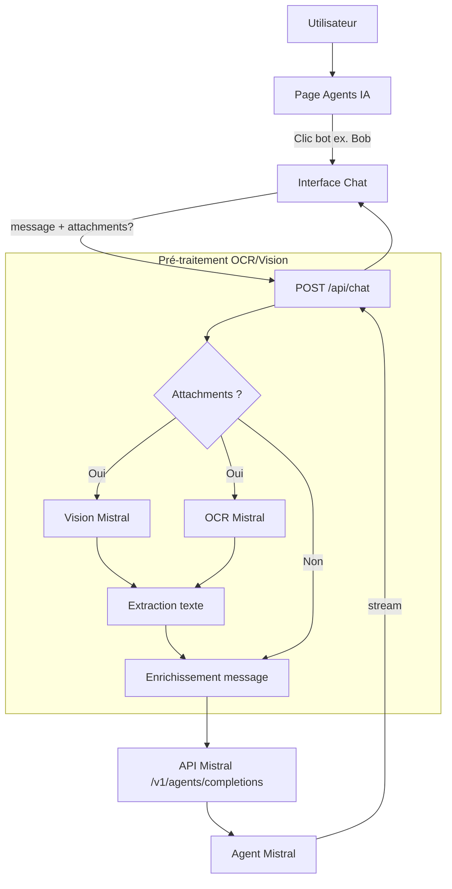

# Bot / Agent IA Standard — Multimodale & Design

Ce document est le **cahier des charges** de référence pour tous les agents IA du SaaS (Bob, Nina, Sinistro, etc.). Il définit l’architecture technique, les flux multimodaux, la dualité de la connaissance, les règles d’instructions et les normes de design UX.

**Vision stratégique :** Architecture **multimodale** (Vision & OCR Mistral) pour traiter nativement images et documents, avec une **dualité de la connaissance** (RAG statique vs dynamique) et une **expérience utilisateur premium** adaptée au contexte commercial.

---

## 1. Architecture : Bots Outils

- **Un bot = un agent Mistral = un objectif.** Pas de chef d’orchestre.
- L’utilisateur **choisit le bot** (ex. Bob) depuis la page Agents IA, puis la conversation part **directement** vers cet agent.
- Le backend reçoit `botId` + `message` + éventuellement `attachments`, applique un **pré-traitement multimodal** (OCR Mistral / Vision), puis appelle l’API Mistral (`/v1/agents/completions`) avec l’Agent ID correspondant.
- Le **cerveau** du bot (prompt système, instructions, RAG statique) est configuré **uniquement dans la console Mistral**. Next.js injecte des metadata et, le cas échéant, le texte extrait des pièces jointes (RAG dynamique).

### Pré-traitement multimodal (Vision & OCR)

Avant tout appel à l’API Mistral, tout fichier joint (image ou document) est traité :

| Type   | Exemples                   | Traitement                                |
|--------|----------------------------|-------------------------------------------|
| Images | Screenshot CRM, JPG, PNG   | Vision Mistral (ex. `mistral-large-latest`) |
| Docs   | PDF, Word, TXT             | OCR Mistral → texte brut                  |

Le texte extrait est injecté dans la fenêtre contextuelle de l’agent (prompt ou message enrichi). Aucun stockage permanent côté Mistral pour ces fichiers de session.

**Cas d’usage :** Le commercial prend une capture d’écran de son CRM, la colle dans le chat : Bob extrait automatiquement le nom, l’âge et le régime social du client.

### Schéma de flux (Mermaid)



Parcours :
1. L’utilisateur ouvre **Mes agents IA**, choisit un bot (ex. Bob).
2. L’interface de chat envoie `POST /api/chat` avec `{ message, botId, history?, attachments? }`.
3. **Si `attachments` est présent :** pré-traitement OCR / Vision → extraction du texte → enrichissement du message ou du contexte (**avant** l’appel Mistral).
4. Next.js récupère la config du bot (Agent ID), appelle **une seule fois** l’API Mistral Agents.
5. La réponse est streamée vers le client et sauvegardée dans Firestore.

---

## 2. La dualité de la connaissance (RAG)

### Vue d’ensemble

| Source             | Description                                                                 | Où ?                              |
|--------------------|-----------------------------------------------------------------------------|-----------------------------------|
| **RAG Statique**   | Bibliothèque de référence (PDFs, table des matières) dans la console Mistral | Table des Matières, bibliothèque agent |
| **RAG Dynamique**  | Fichiers de session extraits à la volée et injectés dans le contexte du bot  | API Next.js → OCR/Vision → prompt |

### RAG Statique (référence)

1. **Ingestion** : PDFs de référence → uploadés dans la **bibliothèque Mistral** de l’agent.
2. **Table des matières** : Les PDFs de référence utilisent une `TABLE-DES-MATIERES.md` (ou `table-des-matieres.pdf`) pour orienter la recherche dans les documents.
3. **Recherche** : outil RAG activé sur l’agent dans la console Mistral.

Le code Next.js **ne gère pas** le RAG statique ; il est entièrement configuré côté Mistral.

### RAG Dynamique (session)

1. **Upload** : L’utilisateur joint un fichier (contrat concurrent, liasse fiscale, screenshot CRM, etc.) pendant la conversation.
2. **Extraction** : OCR Mistral ou Vision → texte brut.
3. **Injection** : Texte extrait injecté dans le prompt ou le message contextuel envoyé à l’Agent ID.
4. **Aucun stockage** permanent : ces documents de session ne sont pas ajoutés à la base de connaissance globale.

**Cas d’usage :** Bob analyse un contrat concurrent que l’utilisateur vient de recevoir, sans l’ajouter à la bibliothèque Mistral.

---

## 3. Standardisation des instructions — La règle d’or

Chaque agent doit structurer ses **instructions** dans la console Mistral selon ce **Mode Opératoire Standard** en trois temps :

| Étape | Rôle       | Contenu                                                                 |
|-------|-------------|-------------------------------------------------------------------------|
| **1. Je vais te donner** | Entrée     | Ce que l’utilisateur fournit (image CRM, liasse fiscale, réponses aux questions, etc.). |
| **2. Tu vas faire**     | Traitement | Ce que l’agent doit accomplir (diagnostic, extraction, comparaison, synthèse). |
| **3. Je m’attends à ce que tu me donnes** | Sortie | Le livrable attendu (tableau de diagnostic, recommandations, montants, etc.). |

**Exemple (Bob) :**
- *Je vais te donner* : une capture CRM, une liasse fiscale ou mes réponses aux blocs 1 à 8.
- *Tu vas faire* : extraire les données (nom, âge, métier, revenus), identifier les garanties SSI/RO, détecter les manques.
- *Je m’attends à ce que tu me donnes* : un tableau de diagnostic (SSI | RO | MANQUE) et une timeline de l’arrêt avec le reste à charge.

Cette structure doit être intégrée dans les **instructions** de chaque agent (Bob, Nina, Sinistro, etc.) dans la console Mistral.

---

## 4. Consignes UI / Design — Expérience commerciale

L’interface des agents ne doit pas ressembler à un simple clone de ChatGPT : elle doit offrir une **expérience professionnelle premium** adaptée au contexte commercial.

### Identité

| Bot       | Code couleur | Avatar / Icône | Usage                         |
|-----------|--------------|----------------|-------------------------------|
| **Bob**   | Bleu         | Avatar dédié   | Santé et prévoyance TNS       |
| **Nina**  | Violet       | Avatar dédié   | Secrétariat, plannings        |
| **Sinistro** | Orange    | Avatar dédié   | Sinistres (IRSA, IRCA, IRSI)  |

Chaque bot a une **identité visuelle cohérente** : couleur de bordure, bulle de message, icône dans la liste des agents.

### Interactions

- **Copier-coller d’images** : support natif du paste d’image (capture d’écran, screenshot) dans le champ de message ou via zone dédiée.
- **Retour visuel sur l’état OCR** : indicateur d’état pour les pièces jointes :
  - `en cours` — extraction en cours (spinner, label « Analyse en cours… »)
  - `terminé` — extraction réussie (icône de validation, texte accessible)
  - `échec` — extraction impossible (message d’erreur, possibilité de réessayer)

### Rendu

- **Tableaux de diagnostic épurés** : Markdown stylisé avec `|` et `---` pour une lecture immédiate.
- **Boutons de copie rapide** : sur chaque bloc de livrable (diagnostic, recommandations, montants), un bouton « Copier » pour coller directement dans le CRM ou un email.

---

## 5. Contrat technique & metadata — POST /api/chat

### Route

`POST /api/chat`

### Body (structure détaillée)

```json
{
  "message": "string",
  "botId": "string",
  "history": [
    { "role": "user | assistant", "content": "string" }
  ],
  "attachments": [
    {
      "file_id": "string",
      "fileType": "image | document",
      "mimeType": "string",
      "data": "string (base64, optionnel)",
      "url": "string (lien temporaire, optionnel)",
      "extraction_status": "pending | done | failed",
      "extracted_text": "string (rempli par le serveur après OCR/Vision)",
      "ocr_confidence": "number 0-1 (optionnel)"
    }
  ],
  "metadata": {
    "client_id": "string (dossier client)",
    "uid_collaborateur": "string",
    "current_step": "string (découverte | devis | M+3 | …)",
    "context_pro": "object (contexte métier: RO, revenus, garanties)"
  }
}
```

### Objet `attachments`

| Champ               | Type   | Utilité                                               |
|---------------------|--------|--------------------------------------------------------|
| `file_id`           | string | Identifiant unique du fichier joint                   |
| `extracted_text`    | string | Texte extrait par OCR/Vision (injecté dans le prompt)  |
| `ocr_confidence`    | number | Score de confiance 0-1 (si fourni par Mistral)         |
| `extraction_status` | enum   | `pending` / `done` / `failed`                          |

### Objet `metadata`

| Champ               | Utilité                                       |
|---------------------|-----------------------------------------------|
| `client_id`         | Ancrage au dossier client                     |
| `uid_collaborateur` | Collaborateur connecté                        |
| `current_step`      | Phase (découverte, devis, M+3)                |
| `context_pro`       | Contexte métier (RO, revenus, garanties)      |

### Réponse

- Stream texte (réponse de l’agent).
- Auth : header `Authorization: Bearer <firebase_id_token>`.

Le handler valide `botId`, charge la config, pré-traite les `attachments` (OCR / Vision), enrichit le message, appelle Mistral, stream la réponse et persiste les messages dans Firestore.

---

## 6. Configuration des bots (Next.js)

Fichier miroir : **`lib/config/agents.ts`**.

- **`BOTS`** : enregistrement `botId → BotConfig` (id, name, agentId, model, description).
- **`agentId`** : ID de l’agent créé dans la console Mistral, fourni via variable d’environnement (ex. `MISTRAL_AGENT_BOB`).
- **`model`** : modèle capable de Vision (ex. `mistral-large-latest`) pour traiter les images.
- Ajouter un nouveau bot = ajouter une entrée dans `BOTS` + créer l’agent dans Mistral + définir la variable d’environnement.

Exemple :

| botId      | Nom      | Rôle                           |
|------------|----------|--------------------------------|
| `bob`      | Bob      | Expert santé et prévoyance TNS |
| `nina`     | Nina     | Secrétariat, plannings         |
| `sinistro` | Sinistro | Sinistres (IRSA, IRCA, IRSI)   |

---

## 7. Historique et Firestore

- **Collection** : `conversations/{sessionId}/messages`
- **sessionId** : `metadata.client_id` si présent (conversation liée à un dossier), sinon `standalone-{uid}-{botId}` (mode page Agents IA).
- Chaque document : `{ role, content, botId?, attachments?, createdAt }`.

L’historique d’une session est renvoyé par le client dans `history` à chaque envoi ; le serveur peut à l’avenir le compléter depuis Firestore si besoin.

---

## 8. Mapping JSON (standard pour tous les bots)

Le `mapping.json` est un **standard par bot** pour structurer la connaissance et guider le RAG :

| Bot         | Objet du mapping                          |
|-------------|-------------------------------------------|
| **Bob**     | Barèmes prévoyance (SSI, RO, franchises)   |
| **Sinistro**| Conventions IRSA, IRCA, IRSI               |
| **Nina**    | Procédures de secrétariat, plannings       |
| **Pauline** | Produits retail, auto, MRH                 |

Structure : sections, pages, thèmes, selon les besoins métier du bot.

---

## 9. Exemple : Bob (santé et prévoyance TNS)

- **Objectif** : Expert santé et prévoyance TNS (SSI, CARPIMKO, CARMF, CAVEC, etc.).
- **Ressources** : documents dans `docs/bots-prelude/bdc-bots/bobsante/` à ingérer dans Mistral (RAG statique / instructions).
- **Comportement** : diagnostic des trous de couverture, qualification, propositions (mutuelle, prévoyance). À définir dans les **instructions** de l’agent Bob dans la console Mistral.

### Table des matières (TOC) pour Bob

Pour que l’agent Bob réponde avec précision sans se perdre dans les PDFs, une **table des matières** est générée et doit être téléversée avec les PDFs dans Mistral :

- **Dossier PDFs** : `docs/bots-prelude/bdc-bots/bobsante/pdf_optimises/` (PDFs renommés en slugs : `brochure-prevoyance-tns.pdf`, `dispositions-generales-prevoyance.pdf`, `table-des-matieres.pdf`, etc.).
- **Fichiers générés** :
  - `table-des-matieres.pdf` (ou `TABLE-DES-MATIERES.md`) : index pour l’agent (document → sections, pages, thèmes). À uploader dans Mistral comme document de navigation.
  - `mapping.json` : structure brute (sections, pages) pour re-génération ou édition manuelle.
- **Génération** : `npm run bob:analyze-pdfs` (analyse tous les PDFs du dossier, détecte les sections, écrit la TOC et le mapping). `npm run bob:table-matieres-pdf` pour régénérer le PDF de la table des matières.
- **Usage** : téléverser les PDFs du dossier + table des matières dans l’espace de travail / bibliothèque de l’agent Bob (Mistral). L’agent s’appuie sur la TOC pour orienter la recherche RAG.

---

## 10. Avantages de cette organisation

- **Simplicité** : un seul appel Mistral par message, pas de routage ni de « Big-Boss ».
- **Multimodalité** : Vision et OCR natifs pour images (CRM, captures) et documents (liasses, contrats).
- **Séparation des rôles** : logique métier et prompts dans Mistral ; Next.js = auth + proxy + pré-traitement + persistance.
- **Évolutivité** : nouveau bot = nouvelle entrée dans `BOTS` + nouvel agent Mistral + variable d’environnement + mapping dédié.
- **Latence** : réponse plus rapide (plus d’étape de classification du premier message).
- **Flux documentaire unifié** : Upload → API Next.js → Mistral OCR/Vision → injection texte dans l’agent.
- **Expérience premium** : identité visuelle par bot, feedback OCR, livrables copiables.

---

## 11. Backlog & Évolutivité

### Capacités futures

- **Function Calling** : mise à jour du CRM depuis l’agent (revenus, garanties, statut dossier, etc.).
- **Analyse automatique de tableaux complexes** : extraction structurée des garanties, barèmes et franchises depuis des documents PDF/Excel.
- **Chat depuis un dossier client** : préremplir `metadata.client_id` et `context_pro` pour ancrer la conversation.
- **Copier-coller d’écran** : support natif du paste d’image (capture, screenshot) dans le chat.
- **Contrat d’Interface API (Swagger/OpenAPI)** : spécification détaillée pour le développeur Next.js, incluant la gestion des fichiers et des images.
- **Autres bots** : Nina (secrétariat), Sinistro (sinistres), Pauline (retail), Expert Retraite, Expert Prévoyance Agricole (AVAMAP).

---

## 12. File d’attente (bots à venir)

- [ ] **Nina** : Secrétariat, plannings.
- [ ] **Sinistro** : Sinistres (IRSA, IRCA, IRSI).
- [ ] **Pauline** : Retail (auto, MRH).
- [ ] **Expert Retraite** : Planification retraite, transmission.
- [ ] **Expert Prévoyance Agricole (AVAMAP)** : Spécificités agriculteurs.
