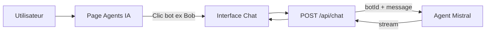

# Bot / Agent IA Standard

Ce document décrit l’**architecture « Bots Outils »** de l’IA du SaaS : chaque bot est un agent Mistral avec un objectif précis. Le code Next.js sert de **passerelle sécurisée** entre l’UI et les Agent IDs Mistral — aucune logique de routage ou de décision côté application.

---

## 1. Architecture : Bots Outils

- **Un bot = un agent Mistral = un objectif.** Pas de chef d’orchestre.
- L’utilisateur **choisit le bot** (ex. Bob) depuis la page Agents IA, puis la conversation part **directement** vers cet agent.
- Le backend reçoit `botId` + `message`, récupère la config du bot dans `lib/config/agents.ts`, et appelle **en un seul appel** l’API Mistral (`/v1/agents/completions`) avec l’Agent ID correspondant.
- Le **cerveau** du bot (prompt système, instructions, RAG) est configuré **uniquement dans la console Mistral**. Next.js n’injecte que des metadata optionnelles (contexte dossier, etc.).

### Flux de données

Parcours :
1. L’utilisateur ouvre **Mes agents IA**, choisit un bot (ex. Bob).
2. L’interface de chat envoie `POST /api/chat` avec `{ message, botId: "bob", history? }`.
3. Next.js récupère la config du bot (Agent ID), appelle **une seule fois** l’API Mistral Agents.
4. La réponse est streamée vers le client et sauvegardée dans Firestore.

---

## 2. Configuration des bots (Next.js)

Fichier miroir : **`lib/config/agents.ts`**.

- **`BOTS`** : enregistrement `botId → BotConfig` (id, name, agentId, model, description).
- **`agentId`** : ID de l’agent créé dans la console Mistral, fourni via variable d’environnement (ex. `MISTRAL_AGENT_BOB`).
- Ajouter un nouveau bot = ajouter une entrée dans `BOTS` + créer l’agent dans Mistral + définir la variable d’environnement.

Exemple :

| botId | Nom   | Rôle                          |
|-------|--------|-------------------------------|
| `bob` | Bob    | Expert santé et prévoyance TNS |

---

## 3. API Chat

- **Route** : `POST /api/chat`
- **Body** : `{ message: string, botId: string, history?: Array<{ role, content }>, metadata?: BotSessionMetadata }`
- **Réponse** : stream texte (réponse de l’agent).
- **Auth** : header `Authorization: Bearer <firebase_id_token>`.

Le handler ne contient **aucune logique de décision** : il valide `botId`, charge la config, appelle Mistral, stream la réponse et persiste les messages dans Firestore.

---

## 4. Historique et Firestore

- **Collection** : `conversations/{sessionId}/messages`
- **sessionId** : `metadata.client_id` si présent (conversation liée à un dossier), sinon `standalone-{uid}-{botId}` (mode page Agents IA).
- Chaque document : `{ role, content, botId?, createdAt }`.

L’historique d’une session est renvoyé par le client dans `history` à chaque envoi ; le serveur peut à l’avenir le compléter depuis Firestore si besoin.

---

## 5. Metadata (optionnel)

Pour un usage futur depuis un **dossier client**, le body peut inclure `metadata` :

| Champ              | Utilité                                      |
|--------------------|----------------------------------------------|
| `client_id`        | Ancrage au dossier client                    |
| `uid_collaborateur`| Collaborateur connecté                       |
| `current_step`     | Phase (découverte, devis, M+3)               |
| `context_pro`      | Contexte métier (RO, revenus, garanties)    |

En mode **standalone** (page Agents IA), `metadata` est absent ou partiel ; `client_id` et `uid_collaborateur` sont optionnels dans le type `BotSessionMetadata`.

---

## 6. Organisation de la connaissance (RAG)

Pour des réponses précises (DG, Vademecums, barèmes) :

1. **Ingestion** : PDF → API OCR Mistral si besoin.
2. **Stockage** : documents dans l’espace de travail / bibliothèque Mistral de l’agent.
3. **Recherche** : outil RAG activé sur l’agent dans la console Mistral.

Le code Next.js ne gère pas le RAG ; il est entièrement configuré côté Mistral.

---

## 7. Exemple : Bob (santé et prévoyance TNS)

- **Objectif** : Expert santé et prévoyance TNS (SSI, CARPIMKO, CARMF, CAVEC, etc.).
- **Ressources** : documents dans `docs/bots-prelude/bdc-bots/bobsante/` à ingérer dans Mistral (RAG / instructions).
- **Comportement** : diagnostic des trous de couverture, qualification, propositions (mutuelle, prévoyance). À définir dans les **instructions** de l’agent Bob dans la console Mistral.

### Table des matières (TOC) pour Bob

Pour que l'agent Bob réponde avec précision sans se perdre dans les PDFs, une **table des matières** est générée et doit être téléversée avec les PDFs dans Mistral :

- **Dossier PDFs** : `docs/bots-prelude/bdc-bots/bobsante/pdf_optimises/` (PDFs renommés en slugs : `brochure-prevoyance-tns.pdf`, `dispositions-generales-prevoyance.pdf`, etc.).
- **Fichiers générés** :
  - `TABLE-DES-MATIERES.md` : index pour l'agent (document → sections, pages, thèmes). À uploader dans Mistral comme document de navigation.
  - `mapping.json` : structure brute (sections, pages) pour re-génération ou édition manuelle.
- **Génération** : `npm run bob:analyze-pdfs` (analyse tous les PDFs du dossier, détecte les sections, écrit la TOC et le mapping). Options : `--rename` pour renommer les PDFs en slugs, `--rename-dry-run` pour simuler le renommage.
- **Usage** : téléverser les PDFs du dossier + `TABLE-DES-MATIERES.md` dans l'espace de travail / bibliothèque de l'agent Bob (Mistral). L'agent pourra s'appuyer sur la TOC pour orienter la recherche RAG.

---

## 8. Avantages de cette organisation

- **Simplicité** : un seul appel Mistral par message, pas de routage ni de « Big-Boss ».
- **Séparation des rôles** : logique métier et prompts dans Mistral ; Next.js = auth + proxy + persistance.
- **Évolutivité** : nouveau bot = nouvelle entrée dans `BOTS` + nouvel agent Mistral + variable d’environnement.
- **Latence** : réponse plus rapide (plus d’étape de classification du premier message).

---

## 9. Capacités futures (backlog)

- **Function Calling** : mise à jour Firestore depuis l’agent (revenus, garanties, etc.).
- **Chat depuis un dossier client** : préremplir `metadata.client_id` et `context_pro` pour ancrer la conversation.
- **Autres bots** : Nina (secrétariat), Sinistro (sinistres), Pauline (retail), etc., selon les besoins.

---

## 10. File d’attente (bots à venir)

- [ ] **Nina** : Secrétariat, plannings.
- [ ] **Sinistro** : Sinistres (IRSA, IRCA, IRSI).
- [ ] **Pauline** : Retail (auto, MRH).
- [ ] **Expert Retraite** : Planification retraite, transmission.
- [ ] **Expert Prévoyance Agricole (AVAMAP)** : Spécificités agriculteurs.
