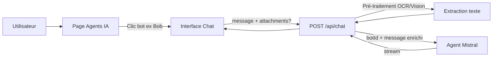

# Bot / Agent IA Standard

Ce document décrit l’**architecture « Bots Outils »** de l’IA du SaaS : chaque bot est un agent Mistral avec un objectif précis. Le code Next.js sert de **passerelle sécurisée** entre l’UI et les Agent IDs Mistral — aucune logique de routage ou de décision côté application.

**Évolution majeure :** Architecture **multimodale** (Vision & OCR) pour traiter nativement images et documents, avec une **dualité de la connaissance** (RAG statique vs dynamique).

---

## 1. Architecture : Bots Outils

- **Un bot = un agent Mistral = un objectif.** Pas de chef d’orchestre.
- L’utilisateur **choisit le bot** (ex. Bob) depuis la page Agents IA, puis la conversation part **directement** vers cet agent.
- Le backend reçoit `botId` + `message` + éventuellement `attachments`, applique un **pré-traitement multimodal** (OCR Mistral / Vision), puis appelle l’API Mistral (`/v1/agents/completions`) avec l’Agent ID correspondant.
- Le **cerveau** du bot (prompt système, instructions, RAG statique) est configuré **uniquement dans la console Mistral**. Next.js injecte des metadata et, le cas échéant, le texte extrait des pièces jointes (RAG dynamique).

### Pré-traitement multimodal (Vision & OCR)

Avant l’envoi au Agent ID, tout fichier joint (image ou document) est traité :

| Type   | Exemples              | Traitement                          |
|--------|------------------------|-------------------------------------|
| Images | Screenshot CRM, JPG, PNG | Vision Mistral (ex. `mistral-large-latest`) |
| Docs   | PDF, Word, TXT        | OCR Mistral → texte brut            |

Le texte extrait est injecté dans la fenêtre contextuelle de l’agent (prompt ou message enrichi). Aucun stockage permanent côté Mistral pour ces fichiers de session.

**Cas d’usage :** Le commercial prend une capture d’écran de son CRM, la colle dans le chat : Bob extrait automatiquement le nom, l’âge et le régime social du client.

### Flux de données



Parcours :
1. L’utilisateur ouvre **Mes agents IA**, choisit un bot (ex. Bob).
2. L’interface de chat envoie `POST /api/chat` avec `{ message, botId: "bob", history?, attachments? }`.
3. Si `attachments` est présent : pré-traitement (OCR / Vision) → extraction du texte → enrichissement du message ou du contexte.
4. Next.js récupère la config du bot (Agent ID), appelle **une seule fois** l’API Mistral Agents.
5. La réponse est streamée vers le client et sauvegardée dans Firestore.

---

## 2. Configuration des bots (Next.js)

Fichier miroir : **`lib/config/agents.ts`**.

- **`BOTS`** : enregistrement `botId → BotConfig` (id, name, agentId, model, description).
- **`agentId`** : ID de l’agent créé dans la console Mistral, fourni via variable d’environnement (ex. `MISTRAL_AGENT_BOB`).
- **`model`** : modèle capable de Vision (ex. `mistral-large-latest`) pour traiter les images.
- Ajouter un nouveau bot = ajouter une entrée dans `BOTS` + créer l’agent dans Mistral + définir la variable d’environnement.

Exemple :

| botId     | Nom      | Rôle                           |
|-----------|----------|--------------------------------|
| `bob`     | Bob      | Expert santé et prévoyance TNS |
| `nina`    | Nina     | Secrétariat, plannings         |
| `sinistro`| Sinistro | Sinistres (IRSA, IRCA, IRSI)   |

---

## 3. API Chat

- **Route** : `POST /api/chat`
- **Contrat TypeScript** : `lib/types/agent-contract.ts` (`BotRequest`, `BotMetadata`, `ChatAttachment`, `SupportedBots`)
- **Body** :

```json
{
  "message": "string",
  "botId": "string",
  "history": "Array<{ role, content }> (optionnel)",
  "attachments": [
    {
      "file_id": "string",
      "fileType": "image | document",
      "mimeType": "string",
      "data": "string (base64, optionnel)",
      "url": "string (lien temporaire, optionnel)",
      "extraction_status": "pending | done | failed",
      "extracted_text": "string (rempli par le serveur)",
      "ocr_confidence": "number 0-1 (optionnel)"
    }
  ],
  "metadata": "BotMetadata (optionnel)"
}
```

- **Réponse** : stream texte (réponse de l’agent).
- **Auth** : header `Authorization: Bearer <firebase_id_token>`.

Le handler valide `botId`, charge la config, pré-traite les `attachments` (OCR / Vision), enrichit le message, appelle Mistral, stream la réponse et persiste les messages dans Firestore.

---

## 4. Historique et Firestore

- **Collection** : `conversations/{sessionId}/messages`
- **sessionId** : `metadata.client_id` si présent (conversation liée à un dossier), sinon `standalone-{uid}-{botId}` (mode page Agents IA).
- Chaque document : `{ role, content, botId?, attachments?, createdAt }`.

L’historique d’une session est renvoyé par le client dans `history` à chaque envoi ; le serveur peut à l’avenir le compléter depuis Firestore si besoin.

---

## 5. Metadata (optionnel)

Pour un usage futur depuis un **dossier client**, le body peut inclure `metadata` :

| Champ               | Utilité                                       |
|---------------------|-----------------------------------------------|
| `client_id`         | Ancrage au dossier client                     |
| `uid_collaborateur` | Collaborateur connecté                        |
| `current_step`      | Phase (découverte, devis, M+3)                |
| `context_pro`       | Contexte métier (RO, revenus, garanties)      |

### Suivi des fichiers (attachments)

| Champ                | Utilité                                                 |
|----------------------|---------------------------------------------------------|
| `file_id`            | Identifiant unique du fichier joint                     |
| `extraction_status`  | `pending` / `done` / `failed` (OCR ou Vision)            |
| `extracted_text`     | Texte extrait par OCR/Vision (injecté dans le prompt)    |
| `ocr_confidence`     | Score de confiance 0-1 (si fourni par Mistral)           |

En mode **standalone** (page Agents IA), `metadata` est absent ou partiel ; `client_id` et `uid_collaborateur` sont optionnels dans le type `BotMetadata`.

---

## 6. Mode Opératoire Standard (règle d’or pour les instructions)

Chaque agent doit structurer ses instructions selon ce canevas en trois temps :

| Étape | Rôle        | Contenu                                                                 |
|-------|-------------|--------------------------------------------------------------------------|
| **1. Je vais te donner** | Entrée   | Ce que l’utilisateur fournit (image CRM, liasse fiscale, réponses aux questions, etc.). |
| **2. Tu vas faire**      | Traitement | Ce que l’agent doit accomplir (diagnostic, extraction, comparaison, synthèse). |
| **3. Je m'attends à ce que tu me donnes** | Sortie | Le livrable attendu (tableau de diagnostic, recommandations, montants, etc.). |

**Exemple (Bob) :**
- *Je vais te donner* : une capture CRM, une liasse fiscale ou mes réponses aux blocs 1 à 8.
- *Tu vas faire* : extraire les données (nom, âge, métier, revenus), identifier les garanties SSI/RO, détecter les manques.
- *Je m'attends à ce que tu me donnes* : un tableau de diagnostic (SSI | RO | MANQUE) et une timeline de l’arrêt avec le reste à charge.

Cette structure doit être intégrée dans les **instructions** de chaque agent (Bob, Nina, Sinistro, etc.) dans la console Mistral.

---

## 7. Organisation de la connaissance (RAG)

### Dualité : RAG Statique vs RAG Dynamique

| Source              | Description                                      | Où ?                   |
|---------------------|--------------------------------------------------|------------------------|
| **RAG Statique**    | Bibliothèque de référence (PDFs, table des matières) | Console Mistral        |
| **RAG Dynamique**   | Fichiers téléversés par l’utilisateur en session | API Next.js → OCR → prompt |

### RAG Statique (référence)

1. **Ingestion** : PDFs de référence → uploadés dans la bibliothèque Mistral de l’agent.
2. **Table des matières** : Les PDFs de référence utilisent une `TABLE-DES-MATIERES.md` (ou `table-des-matieres.pdf`) pour orienter la recherche dans les documents.
3. **Recherche** : outil RAG activé sur l’agent dans la console Mistral.

Le code Next.js ne gère pas le RAG statique ; il est entièrement configuré côté Mistral.

### RAG Dynamique (session)

1. **Upload** : L’utilisateur joint un fichier (contrat concurrent, liasse fiscale, etc.) pendant la conversation.
2. **Extraction** : OCR Mistral ou Vision → texte brut.
3. **Injection** : Texte extrait injecté dans le prompt ou le message contextuel envoyé à l’Agent ID.
4. **Aucun stockage** permanent : ces documents de session ne sont pas ajoutés à la base de connaissance globale.

**Cas d’usage :** Bob analyse un contrat concurrent que l’utilisateur vient de recevoir, sans l’ajouter à la bibliothèque Mistral.

---

## 8. Mapping JSON (standard pour tous les bots)

Le `mapping.json` est un **standard par bot** pour structurer la connaissance et guider le RAG :

| Bot       | Objet du mapping                          |
|-----------|-------------------------------------------|
| **Bob**   | Barèmes prévoyance (SSI, RO, franchises)   |
| **Sinistro** | Conventions IRSA, IRCA, IRSI            |
| **Nina**  | Procédures de secrétariat, plannings      |
| **Pauline** | Produits retail, auto, MRH              |

Structure : sections, pages, thèmes, selon les besoins métier du bot.

---

## 9. Exemple : Bob (santé et prévoyance TNS)

- **Objectif** : Expert santé et prévoyance TNS (SSI, CARPIMKO, CARMF, CAVEC, etc.).
- **Ressources** : documents dans `docs/bots-prelude/bdc-bots/bobsante/` à ingérer dans Mistral (RAG statique / instructions).
- **Comportement** : diagnostic des trous de couverture, qualification, propositions (mutuelle, prévoyance). À définir dans les **instructions** de l’agent Bob dans la console Mistral.

### Table des matières (TOC) pour Bob

Pour que l’agent Bob réponde avec précision sans se perdre dans les PDFs, une **table des matières** est générée et doit être téléversée avec les PDFs dans Mistral :

- **Dossier PDFs** : `docs/bots-prelude/bdc-bots/bobsante/pdf_optimises/` (PDFs renommés en slugs : `brochure-prevoyance-tns.pdf`, `dispositions-generales-prevoyance.pdf`, `table-des-matieres.pdf`, etc.).
- **Fichiers générés** :
  - `table-des-matieres.pdf` (ou `TABLE-DES-MATIERES.md`) : index pour l’agent (document → sections, pages, thèmes). À uploader dans Mistral comme document de navigation.
  - `mapping.json` : structure brute (sections, pages) pour re-génération ou édition manuelle.
- **Génération** : `npm run bob:analyze-pdfs` (analyse tous les PDFs du dossier, détecte les sections, écrit la TOC et le mapping). `npm run bob:table-matieres-pdf` pour régénérer le PDF de la table des matières.
- **Usage** : téléverser les PDFs du dossier + table des matières dans l’espace de travail / bibliothèque de l’agent Bob (Mistral). L’agent s’appuie sur la TOC pour orienter la recherche RAG.

---

## 10. Avantages de cette organisation

- **Simplicité** : un seul appel Mistral par message, pas de routage ni de « Big-Boss ».
- **Multimodalité** : Vision et OCR natifs pour images (CRM, captures) et documents (liasses, contrats).
- **Séparation des rôles** : logique métier et prompts dans Mistral ; Next.js = auth + proxy + pré-traitement + persistance.
- **Évolutivité** : nouveau bot = nouvelle entrée dans `BOTS` + nouvel agent Mistral + variable d’environnement + mapping dédié.
- **Latence** : réponse plus rapide (plus d’étape de classification du premier message).
- **Flux documentaire unifié** : Upload → API Next.js → Mistral OCR/Vision → injection texte dans l’agent.

---

## 11. Capacités futures (backlog)

- **Function Calling** : mise à jour Firestore depuis l’agent (revenus, garanties, etc.).
- **Chat depuis un dossier client** : préremplir `metadata.client_id` et `context_pro` pour ancrer la conversation.
- **Copier-coller d’écran** : support natif du paste d’image (capture, screenshot) dans le chat.
- **Analyse automatique de tableaux complexes** : extraction structurée des garanties, barèmes et franchises depuis des documents PDF/Excel.
- **Autres bots** : Nina (secrétariat), Sinistro (sinistres), Pauline (retail), etc., selon les besoins.
- **Contrat d’Interface API (Swagger/OpenAPI)** : spécification détaillée pour le développeur Next.js, incluant la gestion des fichiers et des images.

---

## 12. File d’attente (bots à venir)

- [ ] **Nina** : Secrétariat, plannings.
- [ ] **Sinistro** : Sinistres (IRSA, IRCA, IRSI).
- [ ] **Pauline** : Retail (auto, MRH).
- [ ] **Expert Retraite** : Planification retraite, transmission.
- [ ] **Expert Prévoyance Agricole (AVAMAP)** : Spécificités agriculteurs.
