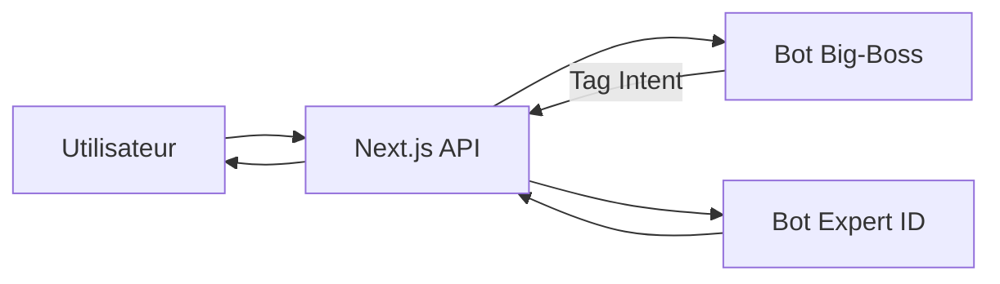

# Bot / Agent IA Standard

Ce document constitue le **plan d'urbanisme** de l'IA du SaaS : architecture **Router & Experts**, orchestration des modèles Mistral, RAG et intégration technique (Next.js / Firebase / Vercel). Il définit un standard industriel évolutif pour une scalabilité totale.

---

## 0. Agent Big-Boss (Chef d'Orchestre)

Agent léger configuré sur **Mistral Small** pour la rapidité. Rôle unique : analyser le **premier message utilisateur** pour classifier l'intention via une **Table de Routage Dynamique**.

Le Big-Boss identifie l'intention **parmi les experts disponibles** dans la Table de Routage Dynamique. S'il ne reconnaît pas d'intention spécifique, il aiguille par défaut vers **`INTENT: GENERAL`**.

### Logique de routage

Le Big-Boss retourne un **tag d'intention strict** pour le backend Next.js :

| Tag retourné | Aiguillage vers |
|--------------|-----------------|
| `INTENT: BILAN` | Expert Prévoyance |
| `INTENT: VISION` | Expert Analyse d'image |
| `INTENT: SUIVI` | Expert M+3 |
| `INTENT: GENERAL` | Expert par défaut (fallback) |

> Le Big-Boss ne traite pas les données — il trie le courrier.

---

## 1. Structure Modulaire d'Agents (Router & Experts)

L'ajout d'un nouvel expert (Retraite, Santé, Sinistre, etc.) se fait simplement en **déclarant son `Agent ID` et son `Tag d'Intention`** dans ce standard. Le code Next.js n'a pas besoin d'être modifié en profondeur — une entrée dans la table et une règle dans le Big-Boss suffisent.

### Table des experts

| Tag d'Intention | Agent ID (Mistral) | Modèle | Rôle |
|-----------------|--------------------|--------|------|
| `BILAN` | Expert Prévoyance | Mistral Large | Plan de découverte client (identité, métier, revenus, besoins) |
| `VISION` | Expert Analyse d'image | Pixtral / Mistral Large | Extraction de garanties depuis une photo de contrat concurrent |
| `SUIVI` | Expert M+3 | Mistral Large | Protocole M+3, conformité Allianz |
| `GENERAL` | Expert par défaut | Mistral Large | Fallback lorsque l'intention ne correspond à aucun expert |

> **Évolutivité** : Pour ajouter un "Expert Retraite" ou "Expert Santé", créez l'agent dans Mistral, ajoutez une ligne dans ce tableau et une règle dans le Big-Boss.

### Outils transverses (partagés)

Tous les agents peuvent **hériter** des **Outils Transverses** selon les besoins du dossier :

| Outil | Usage |
|-------|-------|
| **API Mistral OCR** | Conversion des Vademecums en Markdown pour garder les tableaux lisibles par l'IA |
| **Vision** | Analyse d'image (photo contrat, document scanné) |
| **RAG (Recherche)** | Accès aux DG, Vademecums et documents stockés dans l'espace de travail Mistral |
| **Recherche Web** | Actualisation des barèmes SSI/RO et veille réglementaire |

---

## 2. Organisation de la Connaissance (RAG)

Pour des réponses précises à partir des Dispositions Générales (DG) :

1. **Ingestion** : Envoi des PDF à l'API OCR Mistral.
2. **Stockage** : Enregistrement du texte Markdown dans l'onglet **"Fichiers"** de l'espace de travail Mistral.
3. **Récupération** : Activation de l'outil **"Recherche"** sur l'agent. L'IA ne lit les documents que lorsqu'elle en a besoin.

---

## 3. Comportement (System Prompt)

Dans la console Mistral, les **Instructions** de l'agent suivent deux processus principaux.

### A. Plan de découverte (Phase 1)

L'agent pose les questions une par une :
- Identité
- Métier (RO)
- Revenus (BNC/BIC)
- Besoins vitaux et frais fixes

### B. Processus M+3 (Phase de suivi)

- Si l'utilisateur indique être en phase de suivi, l'agent active le protocole **M+3 (Mise en place + 3 mois)**.
- L'IA vérifie la réception des documents obligatoires (preuve de communication des DG, etc.).

---

## 4. Flux de données



Parcours détaillé :
1. **Utilisateur** → envoie un message au **Next.js (API)**
2. **Next.js** → appelle le **Bot Big-Boss** (Mistral Small)
3. **Big-Boss** → retourne `INTENT: BILAN | VISION | SUIVI | GENERAL`
4. **Next.js** → appelle le **Bot Expert** correspondant (via Agent ID Mistral)
5. **Expert** → traite et répond en streaming
6. **Next.js** → renvoie la réponse à l'utilisateur

---

## 5. Intégration technique (Next.js)

### Backend (Route Handler sur Vercel)

- Utiliser une route API dédiée qui gère le **streaming**.
- Les réponses de l'IA s'affichent en temps réel dans le chat.

### Base de données (Firebase)

| Service | Usage |
|--------|--------|
| **Firestore** | Stockage des sessions de chat. À chaque message, récupération de l'historique pour maintenir le contexte (ex. client « Kiné » ou « Médecin »). |
| **Storage** | Stockage des photos uploadées avant envoi à l'API Vision Mistral. |

---

## 6. Flux de travail utilisateur

1. **Entrée** : Le collaborateur ouvre le chat et choisit « Nouveau Bilan ».
2. **Vision** : Il photographie le contrat actuel du client. Le bot extrait les données (ex. : *« J'ai bien lu le contrat AXA, vous avez une carence de 90 jours. »*).
3. **Documentaire** : Le bot croise ces informations avec les **Vademecums Allianz** stockés en interne.
4. **Sortie** : Le bot affiche le tableau des **3 enveloppes** et propose de générer le mail de synthèse client.

---

## 7. Avantages de cette organisation

En utilisant l'**ID de l'agent** configuré dans un **espace de travail dédié** :

- Le code (Next.js) reste séparé de l'intelligence (Mistral).
- Les règles du Vademecum peuvent être modifiées dans la console Mistral sans redéployer l'application sur Vercel.
- **Performance** : Mistral Small pour le Big-Boss réduit la latence au démarrage de la conversation.
- **Mémoire d'agence** : Grâce aux Metadata, l'IA ne "démarre" jamais à zéro — elle reprend là où le collaborateur s'est arrêté.

---

## 8. Bot Expert Suivi M+3 (Spécification complète)

### Rôle

**Garant de la conformité Allianz** à l'échéance M+3 (Mise en place + 3 mois).

### Actions

1. **Vérification signature DG** : Contrôler que les Dispositions Générales ont bien été signées et reçues par le client.
2. **Cohérence revenus / garanties** : Vérifier l'adéquation entre les revenus actuels déclarés et les garanties souscrites.
3. **Changements de situation familiale** : Détecter tout changement (mariage, naissance, divorce, etc.) pouvant impacter la couverture.

### Livrable

Génération d'une **Note de Conformité M+3** à archiver dans Firestore.

---

## 9. Capacités Avancées (Feuille de Route)

Fonctionnalités pour enrichir le SaaS à l'avenir :

### Function Calling (Sync Firestore)

L'IA doit pouvoir **déclencher des fonctions** pour mettre à jour les champs de la base de données en temps réel pendant la discussion : revenus, régime, composition familiale, garanties souscrites, etc. Le SaaS n'est plus un simple gadget de chat, mais un véritable assistant qui remplit les dossiers clients automatiquement.

### Workflow Multi-Agents

Capacité pour les bots de **collaborer** sans intervention humaine. Exemple : l'expert **VISION** transmet automatiquement les données extraites (garanties, carences) à l'expert **BILAN**, qui poursuit le plan de découverte avec ces informations pré-remplies.

### Veille Réglementaire Dynamique

Utilisation de l'outil **Recherche** pour actualiser les barèmes SSI/RO via le web **lors de chaque bilan**. Les agents restent à jour avec l'évolution réglementaire Allianz.

---

## 10. Metadata (Lien Firebase ↔ Mistral)

Pour que le **Big-Boss** et les **Experts** ne repartent pas de zéro à chaque message, Next.js doit injecter un "contexte invisible" (Metadata) lors de chaque appel API.

### Metadata de session (universelles)

**Chaque bot doit lire** ces métadonnées pour ancrer sa conversation au bon dossier et reprendre là où elle s'est arrêtée :

| Champ Metadata | Utilité pour l'Agent |
|----------------|----------------------|
| `client_id` | **Ancrage au dossier** : identifie le client sur lequel le bot travaille. |
| `current_step` | **Tunnel de vente/suivi** : indique où l'on en est (Découverte, Devis, M+3). |
| `context_pro` | **Chargement du RO** : permet de charger immédiatement le régime obligatoire (RO) concerné. |

### Metadata complémentaires

| Champ Metadata | Source Firebase | Utilité pour l'Agent |
|----------------|-----------------|----------------------|
| `step_id` | Session State | Étape précise (ex : "revenus_bnc", "garanties_souscrites"). |
| `uid_collaborateur` | Auth User | Personnalise l'accueil (ex : "Bonjour Jean-Michel"). |
| `client_statut` | Firestore (RO) | Précise d'emblée si le client est Kiné, Médecin, etc. |
| `has_uploaded_file` | Storage Link | Prévient l'expert VISION qu'une image attend son analyse. |

### Pourquoi ces Metadata sont cruciales

1. **Mémoire instantanée** : Même si la session est coupée, dès que le collaborateur revient sur le dossier de "M. Martin", le bot sait qu'il est déjà à l'étape "Revenus BNC" grâce au `current_step` stocké dans Firestore.
2. **Sécurité** : L'agent ne peut accéder qu'aux fichiers (PDF/Photos) liés au `client_id` de la session en cours.
3. **Aiguillage intelligent** : Si le `client_id` contient déjà un contrat signé depuis 90 jours, le **Big-Boss** peut suggérer automatiquement : *"Je vois que ce contrat a 3 mois, voulez-vous lancer le protocole de suivi M+3 ?"*

### Implémentation (TypeScript)

> Pour Cursor : générer les types TypeScript pour ces interfaces afin de garantir la cohérence entre le backend Next.js et les appels Mistral.

```typescript
interface BotSessionMetadata {
  client_id: string;       // Obligatoire : dossier client
  step_id?: string;        // Étape précise (ex: "revenus_bnc")
  context_pro?: object;    // Contexte métier agrégé (RO, revenus, garanties)
  uid_collaborateur: string;
  client_statut?: string;  // "kiné" | "médecin" | etc.
  current_step?: "decouverte" | "devis" | "m_plus_3";
  has_uploaded_file?: boolean;
}
```

> **Miroir code** : Créer un fichier `config/agents.ts` qui reflète exactement la table des experts. Le Standard documentaire devient le miroir parfait du code Next.js.

---

## 11. Touche finale : Conformité Allianz

En tant qu'agent Allianz, la conformité est votre bouclier. En automatisant la **Note de Conformité M+3** dans Firestore, vous transformez une contrainte administrative en un automatisme digital qui valorise votre agence.

---

## File d'attente (Backlog)

Futurs bots à définir **au fil de l'eau** selon les besoins de l'agence :

- [ ] **Expert Retraite** : Planification retraite, perte de revenus, transmission.
- [ ] **Expert Santé** : Complémentaire santé, comparatif garanties, tiers-payant.
- [ ] **Expert Sinistre** : Accompagnement déclaration, suivi dossier sinistre.
- [ ] **Expert Prévoyance Agricole (AVAMAP)** : Spécificités agriculteurs.
