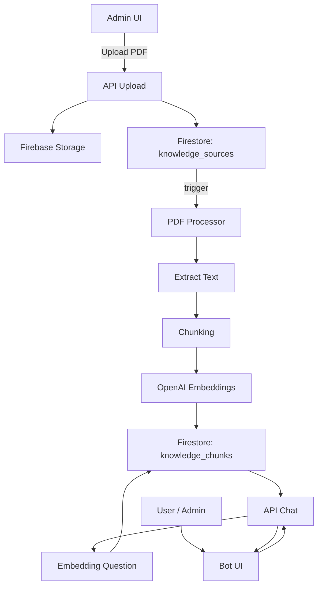

# Plan Technique - Base de Connaissance PDF avec RAG

*Document de référence pour l'implémentation d'une base de connaissance PDF avec RAG*

---

## Table des matières

1. [Prompt Cursor - Plan Technique Global](#prompt-cursor---plan-technique-global)
2. [Diagramme d'Architecture](#diagramme-darchitecture)
3. [Checklist Conformité](#checklist-conformité)
4. [Première API Route - Upload PDF](#première-api-route---upload-pdf)
5. [Prochaines étapes](#prochaines-étapes)
6. [Fonctionnalités déjà implémentées](#fonctionnalités-déjà-implémentées)
7. [Roadmap de Développement - Base de Connaissance RAG](#-roadmap-de-développement---base-de-connaissance-rag)

---

## Prompt Cursor - Plan Technique Global

À donner **tel quel** à Cursor :

```
Tu es un architecte full-stack senior spécialisé Next.js, Firebase et IA (RAG).

Objectif :
Mettre en place une fonctionnalité de base de connaissance PDF pour une application Next.js utilisée par une agence Allianz.

Contexte :
- Next.js App Router
- Firebase Auth avec rôles (admin / user via custom claims)
- Firestore
- Firebase Storage
- OpenAI API
- Le bot est commun à tous les utilisateurs
- Seul l'admin peut téléverser des PDF
- Les PDF deviennent une "source de vérité" pour le bot (RAG)
- Aucune notification Slack
- Sécurité et conformité élevées (contexte assurance)

À produire :
1. Architecture globale
2. Pipeline d'ingestion PDF (upload → extraction → chunking → embeddings)
3. Schéma Firestore complet
4. API Routes / Server Actions nécessaires
5. Sécurité (Auth, Firestore Rules, Storage Rules)
6. Fonctionnement du bot RAG
7. Écrans UI (admin / user)
8. Checklist de déploiement

Contraintes :
- OpenAI uniquement côté serveur
- Firestore utilisé comme base vectorielle (pas de Pinecone)
- Code structuré, maintenable, scalable
- Respect strict du schéma fourni ci-dessous
```

---

## Diagramme d'Architecture



### Explication du flux

1. **Upload (Admin uniquement)** :
   - L'admin upload un PDF via l'interface
   - Le fichier est stocké dans Firebase Storage
   - Une entrée est créée dans `knowledge_sources`

2. **Traitement automatique** :
   - Le PDF est traité (extraction de texte)
   - Le texte est découpé en chunks
   - Des embeddings sont générés pour chaque chunk
   - Les chunks sont stockés dans `knowledge_chunks`

3. **Utilisation (Tous les utilisateurs)** :
   - L'utilisateur pose une question au bot
   - La question est convertie en embedding
   - Recherche de similarité dans `knowledge_chunks`
   - Les chunks pertinents sont utilisés comme contexte
   - Le bot génère une réponse enrichie

---

## Checklist Conformité

### 🔐 Sécurité technique

- [ ] Clé OpenAI uniquement dans `.env.server`
- [ ] Aucun appel OpenAI côté client
- [ ] Accès Firestore `knowledge_*` → serveur uniquement
- [ ] Storage : pas d'accès public
- [ ] Vérification systématique du rôle admin

### 📜 RGPD

- [ ] Aucun PDF client nominatif sans base légale
- [ ] Usage interne clairement défini
- [ ] Possibilité de désactiver une source (`isActive`)
- [ ] Journalisation des uploads (qui / quand)

### 🏛 ACPR / Assurance

- [ ] Versionnage des documents
- [ ] Traçabilité des sources utilisées par le bot
- [ ] Réponses non inventées ("je ne sais pas" autorisé)
- [ ] Cohérence inter-collaborateurs

---

## Première API Route - Upload PDF

### `/app/api/admin/knowledge/upload/route.ts`

```typescript
import { NextResponse } from "next/server"
import { getAuth } from "firebase-admin/auth"
import { db, storage } from "@/lib/firebase-admin"
import { v4 as uuidv4 } from "uuid"

export async function POST(req: Request) {
  const token = req.headers.get("authorization")?.replace("Bearer ", "")
  if (!token) return NextResponse.json({ error: "Unauthorized" }, { status: 401 })

  const decoded = await getAuth().verifyIdToken(token)
  if (decoded.role !== "admin") {
    return NextResponse.json({ error: "Forbidden" }, { status: 403 })
  }

  const formData = await req.formData()
  const file = formData.get("file") as File
  const title = formData.get("title") as string
  const category = formData.get("category") as string

  if (!file) {
    return NextResponse.json({ error: "No file" }, { status: 400 })
  }

  const sourceId = uuidv4()
  const buffer = Buffer.from(await file.arrayBuffer())

  const storagePath = `knowledge-base/pdf/${sourceId}.pdf`
  await storage.bucket().file(storagePath).save(buffer)

  await db.collection("knowledge_sources").doc(sourceId).set({
    id: sourceId,
    title,
    category,
    storagePath,
    uploadedBy: decoded.uid,
    status: "uploaded",
    isActive: true,
    createdAt: new Date(),
    updatedAt: new Date()
  })

  return NextResponse.json({ success: true, sourceId })
}
```

### Notes d'implémentation

- **Authentification** : Vérification du token Firebase côté serveur
- **Autorisation** : Seuls les admins peuvent uploader
- **Stockage** : Fichier PDF dans Firebase Storage avec un chemin structuré
- **Métadonnées** : Enregistrement dans Firestore avec statut initial "uploaded"
- **Prochaines étapes** : Déclencher le traitement automatique après l'upload

---

## Prochaines étapes

### Brique 1 : Extraction PDF + Chunking

**Objectif** : Extraire le texte d'un PDF et le découper en chunks optimaux pour le RAG.

**Fonctionnalités** :
- Extraction de texte depuis le PDF (bibliothèque `pdf-parse` ou similaire)
- Découpage en chunks de taille optimale (500-1000 tokens)
- Overlap entre chunks pour préserver le contexte (50-100 tokens)
- Gestion des erreurs (PDF corrompu, texte non extractible)

**Schéma Firestore** :
```typescript
knowledge_chunks {
  id: string
  sourceId: string
  chunkIndex: number
  text: string
  tokenCount: number
  metadata: {
    pageNumber?: number
    section?: string
  }
  createdAt: Timestamp
}
```

---

### Brique 2 : Génération d'Embeddings OpenAI

**Objectif** : Convertir chaque chunk en vecteur d'embedding pour la recherche sémantique.

**Fonctionnalités** :
- Appel à l'API OpenAI Embeddings (`text-embedding-3-small` ou `text-embedding-3-large`)
- Stockage des embeddings dans Firestore
- Gestion du rate limiting OpenAI
- Retry automatique en cas d'erreur

**Schéma Firestore** :
```typescript
knowledge_chunks {
  // ... champs précédents
  embedding: number[] // 1536 dimensions pour text-embedding-3-small
  embeddingModel: string // "text-embedding-3-small"
}
```

---

### Brique 3 : Moteur de Similarité Cosine Firestore

**Objectif** : Rechercher les chunks les plus pertinents pour une question donnée.

**Fonctionnalités** :
- Conversion de la question en embedding
- Calcul de similarité cosine entre la question et tous les chunks
- Tri par score décroissant
- Filtrage par seuil de pertinence (ex: > 0.7)
- Limitation au top K (ex: top 5)

**Algorithme** :
```typescript
// Pseudocode
function findSimilarChunks(questionEmbedding: number[], topK: number = 5) {
  const chunks = await db.collection("knowledge_chunks")
    .where("isActive", "==", true)
    .get()
  
  const scores = chunks.map(chunk => ({
    chunk,
    score: cosineSimilarity(questionEmbedding, chunk.embedding)
  }))
  
  return scores
    .filter(s => s.score > 0.7)
    .sort((a, b) => b.score - a.score)
    .slice(0, topK)
}
```

---

### Brique 4 : Prompt Système Final du Bot

**Objectif** : Construire un prompt système qui utilise efficacement le contexte RAG.

**Structure du prompt** :
```
Tu es un assistant spécialisé en assurance Allianz pour une agence.

CONTEXTE MÉTIER (depuis la base de connaissances) :
{chunks pertinents formatés}

QUESTION UTILISATEUR :
{question}

INSTRUCTIONS :
- Réponds uniquement en te basant sur le contexte fourni
- Si le contexte ne contient pas l'information, dis "Je ne sais pas"
- Cite toujours tes sources (titre du document)
- Sois précis et factuel
- Adapte ton langage au contexte professionnel assurance
```

---

### Brique 5 : UI Admin "Sources de Connaissance"

**Objectif** : Interface complète pour gérer la base de connaissances.

**Fonctionnalités** :
- **Upload de PDF** : Drag & drop ou sélection de fichier
- **Liste des sources** : Affichage de tous les documents indexés
- **Statut de traitement** : uploaded → processing → indexed → error
- **Actions** :
  - Activer/Désactiver une source
  - Supprimer une source (et ses chunks)
  - Voir les détails (nombre de chunks, date d'indexation)
- **Recherche** : Filtrer par titre, catégorie, statut

**Composants nécessaires** :
- `KnowledgeSourcesList.tsx` : Liste des sources
- `UploadKnowledgeSourceDialog.tsx` : Modal d'upload
- `KnowledgeSourceCard.tsx` : Carte d'une source
- `KnowledgeSourceDetails.tsx` : Détails d'une source

---

## Schéma Firestore Complet

### Collection `knowledge_sources`

```typescript
{
  id: string
  title: string
  category: string // "contrats", "procedures", "offres", etc.
  storagePath: string // Chemin dans Firebase Storage
  uploadedBy: string // userId
  status: "uploaded" | "processing" | "indexed" | "error"
  isActive: boolean
  errorMessage?: string
  chunkCount?: number
  createdAt: Timestamp
  updatedAt: Timestamp
}
```

### Collection `knowledge_chunks`

```typescript
{
  id: string
  sourceId: string
  chunkIndex: number
  text: string
  tokenCount: number
  embedding: number[] // 1536 dimensions
  embeddingModel: string
  metadata: {
    pageNumber?: number
    section?: string
  }
  createdAt: Timestamp
}
```

### Index Firestore requis

```json
{
  "indexes": [
    {
      "collectionGroup": "knowledge_chunks",
      "queryScope": "COLLECTION",
      "fields": [
        { "fieldPath": "sourceId", "order": "ASCENDING" },
        { "fieldPath": "chunkIndex", "order": "ASCENDING" }
      ]
    },
    {
      "collectionGroup": "knowledge_sources",
      "queryScope": "COLLECTION",
      "fields": [
        { "fieldPath": "isActive", "order": "ASCENDING" },
        { "fieldPath": "createdAt", "order": "DESCENDING" }
      ]
    }
  ]
}
```

---

## Règles de Sécurité Firestore

### Firestore Rules

```javascript
rules_version = '2';
service cloud.firestore {
  match /databases/{database}/documents {
    // knowledge_sources : lecture pour tous, écriture admin uniquement
    match /knowledge_sources/{sourceId} {
      allow read: if request.auth != null;
      allow create, update, delete: if request.auth != null 
        && get(/databases/$(database)/documents/users/$(request.auth.uid)).data.role == 'admin';
    }
    
    // knowledge_chunks : lecture pour tous, écriture serveur uniquement
    match /knowledge_chunks/{chunkId} {
      allow read: if request.auth != null;
      allow write: if false; // Uniquement via Admin SDK côté serveur
    }
  }
}
```

### Storage Rules

```javascript
rules_version = '2';
service firebase.storage {
  match /b/{bucket}/o {
    // knowledge-base : upload admin uniquement, lecture pour tous
    match /knowledge-base/pdf/{fileName} {
      allow read: if request.auth != null;
      allow write: if request.auth != null 
        && firestore.get(/databases/(default)/documents/users/$(request.auth.uid)).data.role == 'admin';
    }
  }
}
```

---

## Checklist de Déploiement

### Phase 1 : Infrastructure

- [ ] Créer les collections Firestore (`knowledge_sources`, `knowledge_chunks`)
- [ ] Créer les index Firestore nécessaires
- [ ] Configurer les Firestore Rules
- [ ] Configurer les Storage Rules
- [ ] Vérifier les variables d'environnement (OpenAI API key)

### Phase 2 : Backend

- [ ] Implémenter l'API route `/api/admin/knowledge/upload`
- [ ] Implémenter le traitement PDF (extraction + chunking)
- [ ] Implémenter la génération d'embeddings
- [ ] Implémenter la recherche de similarité
- [ ] Intégrer le RAG dans l'API chat existante

### Phase 3 : Frontend

- [ ] Créer l'interface admin d'upload
- [ ] Créer la liste des sources de connaissance
- [ ] Intégrer les sources dans les réponses du bot
- [ ] Ajouter les indicateurs de statut de traitement

### Phase 4 : Tests & Validation

- [ ] Tester l'upload de PDF (admin)
- [ ] Vérifier l'extraction et le chunking
- [ ] Vérifier la génération d'embeddings
- [ ] Tester la recherche de similarité
- [ ] Tester les réponses RAG du bot
- [ ] Valider la sécurité (accès non-admin)

### Phase 5 : Documentation & Formation

- [ ] Documenter l'utilisation pour les admins
- [ ] Former les admins à l'upload de documents
- [ ] Créer un guide de bonnes pratiques (catégories, titres)

---

## Notes Techniques

### Choix d'implémentation

- **Firestore comme base vectorielle** : Simple et intégré, mais moins performant que Pinecone pour de très gros volumes. Suffisant pour une agence.
- **OpenAI Embeddings** : `text-embedding-3-small` (1536 dimensions) est un bon compromis coût/performance.
- **Chunking** : 500-1000 tokens avec overlap de 50-100 tokens pour préserver le contexte.

### Limitations connues

- **Taille des PDF** : Limiter à 20 MB par fichier
- **Nombre de chunks** : Firestore limite à 1 MB par document, donc les embeddings doivent être stockés séparément si nécessaire
- **Recherche vectorielle** : Firestore ne supporte pas nativement la recherche vectorielle, il faut calculer la similarité côté serveur

### Optimisations futures

- **Cache des embeddings** : Éviter de régénérer les embeddings pour les mêmes chunks
- **Indexation incrémentale** : Traiter les nouveaux PDF en arrière-plan
- **Compression des embeddings** : Utiliser des techniques de compression si nécessaire

---

## Fonctionnalités déjà implémentées

### Collage d'images dans le chat

**État** : ✅ **Déjà implémenté et opérationnel**

**Accessibilité** : Accessible à **tous les utilisateurs authentifiés, quel que soit leur rôle** (admin, CDC, commercial, etc.)

**Implémentation** :
- Collage d'images via Ctrl+V / Cmd+V dans tous les composants de chat
- Support dans le chat standard (`/api/assistant/chat`) pour tous les utilisateurs
- Support dans le mode RAG (`/api/assistant/rag`) pour les administrateurs
- Composants concernés :
  - `components/assistant/FloatingAssistant.tsx`
  - `components/assistant/AssistantDrawer.tsx`
  - `app/commun/outils/assistant-ia/page.tsx`

**Documentation** : Voir `docs/fonctionnalites-bot-ia.md` - Section "Support des images"

**Conclusion** : Aucune modification nécessaire. La fonctionnalité est déjà en place et fonctionnelle.

---

## 🗺️ Roadmap de Développement - Base de Connaissance RAG

*Plan de développement spécifique à la base de connaissance PDF/RAG*

### Phase 1 : Amélioration Base RAG (Q1 2025) 🔥

#### 1.1. Support de Formats Additionnels
- Upload Word (.docx) dans base RAG
- Upload Excel (.xlsx) dans base RAG
- Upload images avec OCR dans base RAG
- Extraction de texte depuis Word/Excel

#### 1.2. Gestion Avancée des Documents
- Catégorisation automatique des documents
- Versionning des documents
- Désactivation/activation de sources
- Statistiques d'utilisation des sources

#### 1.3. Recherche Améliorée
- Recherche par mots-clés
- Recherche par date de document
- Recherche par catégorie
- Résumés automatiques de documents
- Comparaison de documents
- Détection de contradictions entre documents

#### 1.4. Améliorations Techniques
- Stockage Firebase Storage pour PDF originaux
- Schéma Firestore complet (status, isActive, storagePath, etc.)
- Règles de sécurité Firestore et Storage
- Index Firestore optimisés
- Filtrage par isActive dans recherche vectorielle
- Système de statut asynchrone (uploaded → processing → indexed → error)

### Phase 2 : Intégration Métier (Q2 2025) 🟡

#### 2.1. Documents Métier Spécialisés
- Upload de contrats types Allianz
- Upload de conditions générales
- Upload de guides procédures
- Upload d'offres commerciales

#### 2.2. Recherche Contextuelle
- Recherche par type de contrat
- Recherche par garantie
- Recherche par client type (particulier/pro/entreprise)
- Recherche par produit (auto, santé, prévoyance, etc.)

### Phase 3 : Analytics et Optimisation (Q3 2025) 🟢

#### 3.1. Statistiques
- Statistiques d'utilisation des sources
- Métriques de pertinence des réponses
- Analyse des questions les plus fréquentes
- Taux de satisfaction par source

#### 3.2. Optimisation
- Cache des embeddings
- Indexation incrémentale
- Compression des embeddings si nécessaire
- Optimisation de la recherche vectorielle (si volume augmente)

---

**Voir la roadmap complète** : `docs/fonctionnalites-bot-ia.md` - Section "Roadmap de Développement"

---

*Document créé le : 2025*
*Dernière mise à jour : 2025*

