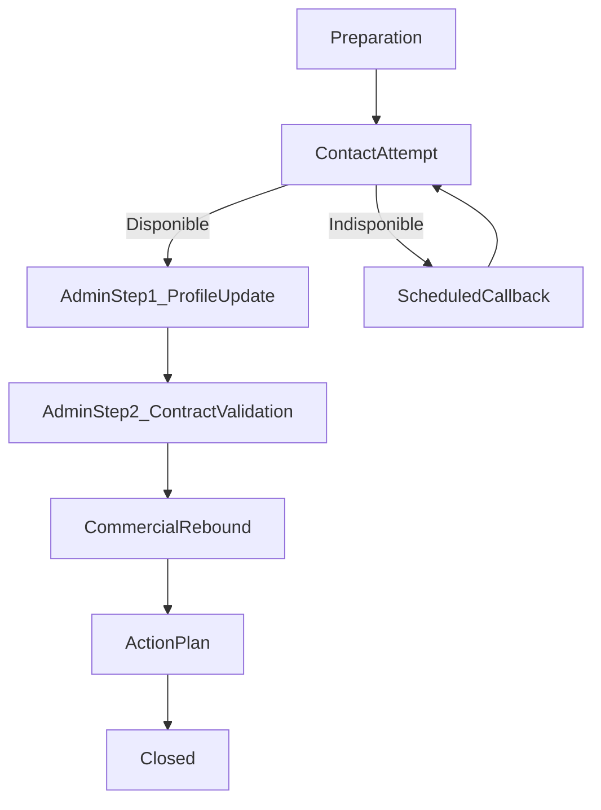

# M+3 — Process de suivi client (a ~3 mois)

Ce document decrit le workflow M+3 a implementer dans le bot, avec une posture obligatoire en deux temps : administratif puis rebond commercial.

## 1. Cadrage metier

### Pourquoi le M+3 existe

Le client entre souvent par un besoin ponctuel. Le M+3 sert a :

1. Renforcer la relation de confiance.
2. Mettre le dossier client et les contrats en conformite.
3. Ouvrir un bilan global sans effet de vente forcee.

### Quand et pour qui

- Cible : toutes les affaires nouvelles (chalandise, recommandation, apporteurs, leads).
- Timing : environ 3 mois apres la souscription initiale.

### Definition d’un M+3 reussi

1. Fiche client a jour.
2. Contrats valides administrativement (signature + pieces).
3. Contrats externes identifies + manques clarifies.
4. Plan d’action trace (devis, RDV, relances, responsable, date).

## 2. Regles de conduite incontournables

1. Toujours commencer par l’administratif.
2. Ne lancer le rebond commercial qu’apres validation administrative.
3. Utiliser un langage de service ("mise a jour dossier"), pas de pression commerciale.
4. Si le client n’est pas disponible, basculer vers une prise de rendez-vous.
5. Limiter les priorites commerciales a 2-3 axes max par appel.

## 3. Workflow cible (agent + bot)

## 3.1 Phase preparation (avant appel)

Objectif : savoir exactement ce qu’il manque avant de contacter le client.

Entrees :
- Fiche client Lagon
- Contrats actifs chez nous
- Statut signature/pieces

Sorties :
- Checklist "a confirmer"
- Checklist "manquant"
- Questions prioritaires pretes a poser

## 3.2 Phase contact

Script d’ouverture type :

1. Presentation :
   - "Bonjour [prenom], [prenom agent], votre agence Allianz."
2. Recontextualisation :
   - "Nous assurons votre [auto/maison/etc.] depuis environ 3 mois."
3. Variante vendeur :
   - Soit "c’etait avec moi que vous aviez fait le contrat"
   - Soit "c’etait avec [prenom collegue]"
4. Autorisation :
   - "Est-ce que vous avez 5 minutes ? J’ai besoin de mettre a jour votre dossier client."

Decision :
- Reponse oui -> poursuivre.
- Reponse non -> prise de rendez-vous + trace.

## 3.3 Etape administrative 1 — Mise a jour fiche client

Verifier/mettre a jour :
- Nom, prenom, adresse d’envoi
- Telephone, email
- Situation matrimoniale
- Situation professionnelle
- Si pro/entreprise : SIREN, NAF, activite

Regle TNS :
- Si TNS detecte, meme avec un contrat particulier uniquement :
  - fiche etiquetee pro/TNS
  - charge de clientele renseigne correctement

## 3.4 Etape administrative 2 — Validation contrats

Verifier avec le client :
- Signature des contrats
- Pieces administratives attendues
- Comprehension de ce qui est souscrit (reformulation utile et contextuelle)

Sortie :
- Contrats "OK"
- Contrats "a completer" + plan de recuperation (canal + echeance)

## 3.5 Rebond commercial (apres administratif uniquement)

Phrase pivot :
- "Merci pour votre confiance. Pour les contrats que vous n’avez pas chez Allianz, qui sont vos autres assureurs ?"

Conduite :
- Se taire, laisser repondre.
- Cartographier les contrats ailleurs.
- Identifier les manques structurants (ex : PJ, GAV, retraite, prevoyance).
- Proposer un bilan global des contrats externes + completions utiles.

## 3.6 Cloture

Produire un plan d’action date :
- Devis a produire
- RDV bilan a fixer
- Relances a programmer
- Proprietaire de chaque action

## 4. Specification prete code

## 4.1 Machine d’etats



## 4.2 Etat des donnees (suggestion)

```ts
type M3WorkflowState =
  | "preparation"
  | "contact_attempt"
  | "scheduled_callback"
  | "admin_profile_update"
  | "admin_contract_validation"
  | "commercial_rebound"
  | "action_plan"
  | "closed";

type ContactAvailability = "available_now" | "not_available";

type ContractAdministrativeStatus = "complete" | "missing_signature" | "missing_documents";
```

## 4.3 Donnees minimales a persister

- `clientIdentity`: nom, prenom, contact, adresse.
- `clientSituation`: familiale + professionnelle.
- `businessData`: siren, naf, activite si pro.
- `contactAttempt`: date, agent, resultat (dispo/rdv).
- `contractAdministrativeChecks`: contrat, signature, pieces, manquants.
- `externalInsurers`: liste des assureurs/contrats hors Allianz.
- `coverageGaps`: protections manquantes prioritaires.
- `actionPlan`: actions, dueDate, owner, status.

## 4.4 Handlers par etape

- `buildPreparationChecklist(input)` : construit a_confirmer / manquant / questions.
- `handleContactAvailability(answer)` : route vers appel direct ou RDV.
- `validateClientProfileStep(payload)` : met a jour la fiche client.
- `validateContractAdministrativeStep(payload)` : valide signatures/pieces.
- `runCommercialRebound(payload)` : capte contrats externes + manques.
- `buildActionPlan(payload)` : genere devis/RDV/relances dates.

Chaque handler doit :
- valider les donnees entrantes,
- retourner un resultat explicite,
- produire des erreurs lisibles en cas d’entree invalide.

## 5. Prompts conversationnels par etape

## 5.1 Prompt systeme (extrait)

"Tu es un assistant M+3 pour conseiller Allianz. Tu respectes strictement l’ordre suivant : preparation, administratif etape 1, administratif etape 2, puis rebond commercial. Tu n’autorises jamais le rebond commercial avant validation complete des deux etapes administratives."

## 5.2 Prompt d’ouverture appel

"Propose une introduction courte, chaleureuse et professionnelle. Mentionne le contrat souscrit il y a environ 3 mois. Demande explicitement si le client a 5 minutes. Si non, propose un RDV."

## 5.3 Prompt etape administrative 1

"Fais verifier les champs identite et situation client. Si profil professionnel detecte, demande SIREN, NAF et activite. Si TNS, force la verification du rattachement pro."

## 5.4 Prompt etape administrative 2

"Fais valider signatures et pieces contrat par contrat. Reformule de facon utile ce qui a ete souscrit pour valider la comprehension et la pertinence."

## 5.5 Prompt rebond commercial

"Quand les deux etapes administratives sont terminees, remercie le client et pose la question sur les autres assureurs. Laisse une pause dans la formulation. Identifie 2 a 3 manques prioritaires maximum et propose un bilan global."

## 6. Specification UI minimale

## 6.1 Blocs interface

1. `PreparationPanel`
   - tableaux : "a confirmer", "manquant", "questions a poser"
2. `CallScriptPanel`
   - script d’ouverture + variante vendeur/collegue + statut disponibilite
3. `AdministrativeChecklistPanel`
   - onglet fiche client
   - onglet validation contrats
4. `CommercialReboundPanel`
   - contrats ailleurs
   - manques prioritaires
5. `ActionPlanPanel`
   - devis, RDV, relances, responsabilites

## 6.2 Boutons standard

- Disponibilite : `5 min maintenant`, `Rappeler plus tard`
- Fiche client : `Confirme`, `Modifie`, `Non repondu`
- Conformite contrat : `Signe`, `Piece manquante`, `A relancer`
- Rebond : `Contrat ailleurs`, `Pas de couverture`, `A creuser`
- Action : `Creer devis`, `Planifier RDV`, `Programmer relance`

## 6.3 Regles UX

- Afficher l’etape courante en permanence.
- Bloquer l’acces au rebond tant que les deux etapes admin ne sont pas valides.
- Montrer un resume de progression (ex : 2/5 etapes).
- Proposer des textes courts pre-remplis, modifiables par l’agent.

## 7. Sorties attendues

1. `resume_m3`
   - qualite fiche client
   - statut administratif des contrats
   - contrats ailleurs identifies
2. `mail_client`
   - synthese de l’appel
   - prochaines etapes
3. `action_plan`
   - devis / RDV / relances, dates et responsables
4. `quality_checklist`
   - champs/pieces manquants
   - niveau de completion

## 8. Critere de validation fonctionnelle

Le process est conforme si :
- l’ordre admin1 -> admin2 -> rebond est respecte sans exception,
- la branche indisponible cree un RDV planifie,
- la fiche client est completee avant toute proposition commerciale,
- les manques de couverture sont limites et priorises,
- un plan d’action concret est trace en sortie.

## 9. Annexes techniques (references pour le bot)

### Annexe A : Champs a verifier

#### Personne physique — Champs nécessaires

| Champ | Description |
|-------|-------------|
| Numéro Lagon | Identifiant unique client |
| Date de création de la fiche | Date d'ouverture du dossier |
| Genre | M / F / Autre |
| Prénom | |
| Nom | |
| Adresse complète | Rue, code postal, ville |
| Mail | |
| Téléphone | |
| Situation matrimoniale | Célibataire / Marié(e) / Pacsé(e) / Divorcé(e) / Veuf(ve) |
| Enfants | Oui / Non (nombre si oui) |
| Situation professionnelle | Statut professionnel |

#### Personne morale — Champs nécessaires

| Champ | Description |
|-------|-------------|
| Numéro Lagon | Identifiant unique client |
| Date de création de la fiche | Date d'ouverture du dossier |
| Raison sociale | Nom de l'entreprise |
| Qui la gère | Personne physique (figure sous le nom de la personne morale) |
| Téléphone | |
| Mail | |
| SIRET | |
| NAF | Code activité |
| Date de création | Date de création de l'entreprise |

**Note** : Le bot utilise ces références pour identifier ce qui est présent/absent lors de l'analyse.

---

### Annexe B : Contrats possibles par type de client

Le bot IA doit connaître **tous les contrats possibles** selon le type de client pour identifier les opportunités commerciales et les trous logiques.

#### Personne physique (Particulier)

##### A) IARD (biens / responsabilité)

1. **Auto / Moto** (`auto_moto`)
   - Assurance auto (tiers, tiers+, tous risques)
   - Assurance moto
   - Assurance utilitaire

2. **MRH — Habitation** (`mrh_habitation`)
   - Locataire
   - Propriétaire occupant

3. **PNO — Propriétaire non occupant** (`pno`)
   - Propriétaire bailleur
   - Logement vacant

4. **GAV — Garantie Accidents de la Vie** (`gav`)
   - Accidents corporels hors auto
   - Invalidité, décès accidentel

5. **Protection juridique** (`protection_juridique`)
   - Litiges consommation, immobilier, travail
   - Conflits familiaux, voisinage
   - Risques numériques

6. **Objets de valeur** (`objets_valeur`)
   - Bijoux, collections
   - Œuvres d'art
   - Instruments de musique

7. **Assurance scolaire** (`assurance_scolaire`)
   - Responsabilité civile scolaire
   - Accidents, activités extra-scolaires

8. **Animaux (chien/chat)** (`assurance_animaux`)
   - Santé animale
   - Responsabilité civile animaux

9. **Nautisme** (`nautisme`)
   - Bateau, voilier
   - Jet-ski, scooter des mers

10. **Résidence secondaire** (`residence_secondaire`)
    - Logement secondaire
    - Résidence portuaire

11. **Équipements spécifiques** (`equipements_specifiques`)
    - Piscine
    - Cave à vins
    - Énergies renouvelables
    - Appareils électroniques

##### B) Assurance de la personne (santé / prévoyance / protection)

12. **Santé individuelle** (`sante_individuelle`)
    - Complémentaire santé
    - Surcomplémentaire santé
    - Tiers payant

13. **Prévoyance arrêt / invalidité** (`prevoyance_itt_ipt`)
    - ITT (Incapacité Temporaire Totale)
    - IPT (Incapacité Permanente Totale)
    - Décès accidentel

14. **Assurance emprunteur** (`assurance_emprunteur`)
    - Prêt immobilier
    - Prêt consommation

15. **Épargne retraite** (`epargne_retraite`)
    - PER (Plan Épargne Retraite)
    - Assurance vie

16. **Dépendance** (`dependance`)
    - Perte d'autonomie
    - Aide à domicile

---

#### Professionnel (TNS — Travailleur Non Salarié)

> **Note** : Pour un TNS, toujours raisonner en **2 paniers** : **personnel du dirigeant** + **activité professionnelle**.

##### A) IARD Pro (activité professionnelle)

1. **RC Pro générale** (`rc_pro_generale`)
   - Responsabilité civile professionnelle
   - Tous les TNS (artisans, commerçants, professions libérales)

2. **RC médicale / paramédicale** (`rc_medicale_paramedicale`)
   - Médecins, chirurgiens, dentistes
   - Kinésithérapeutes, infirmiers
   - Professions paramédicales

3. **Décennale** (`decennale`)
   - Artisans du bâtiment
   - Constructeurs, maîtres d'œuvre
   - Activités de construction

4. **Multirisque pro** (`multirisque_pro`)
   - Locaux professionnels
   - Contenu, outillage, stock
   - Matériel professionnel

5. **Perte d'exploitation pro** (`perte_exploitation_pro`)
   - Continuité d'activité
   - Charges fixes
   - Chiffre d'affaires

6. **Bris de machine pro** (`bris_machine_pro`)
   - Machines, équipements critiques
   - Outillage spécialisé

7. **Auto mission / flotte** (`auto_mission_flotte`)
   - Véhicules professionnels
   - Transport de marchandises
   - Flotte

8. **Cyber pro** (`cyber_pro`)
   - Protection données
   - Cyberattaques
   - E-réputation

9. **Protection juridique pro** (`protection_juridique_pro`)
   - Litiges professionnels
   - Défense prud'hommes
   - Conflits avec organismes sociaux

##### B) Personnel du dirigeant TNS

10. **Santé TNS** (`sante_tns`)
    - Complémentaire santé dirigeant
    - Pas de mutuelle employeur

11. **Prévoyance TNS** (`prevoyance_tns`)
    - ITT/IPT dirigeant
    - Décès
    - Protection revenus

12. **Retraite TNS** (`retraite_tns`)
    - Épargne retraite dirigeant
    - PER TNS

---

#### Entreprise (Personne morale)

##### A) IARD Entreprise (pour l'entreprise)

1. **RC exploitation / produits / prestations** (`rc_exploitation_produits_prestations`)
   - Responsabilité civile entreprise
   - RC produits
   - RC prestations

2. **Multirisque entreprise** (`multirisque_entreprise`)
   - Bâtiments, locaux
   - Contenu, matériel, stock
   - Informatique

3. **Perte d'exploitation** (`perte_exploitation_entreprise`)
   - Continuité d'activité
   - Charges fixes
   - Chiffre d'affaires

4. **Bris de machine entreprise** (`bris_machine_entreprise`)
   - Machines, équipements critiques
   - Production, informatique

5. **Cyber entreprise** (`cyber_entreprise`)
   - Protection données
   - Cyberattaques
   - E-réputation
   - E-commerce

6. **D&O — Dirigeants et mandataires** (`do_dirigeants`)
   - Protection dirigeants
   - Administrateurs
   - Mandataires sociaux

7. **RC transporteur** (`rc_transporteur`)
   - Transport de marchandises
   - Logistique, livraisons

8. **TRC / DO — Travaux et dommages ouvrage** (`trc_do_entreprise`)
   - Travaux de construction
   - Dommages ouvrage
   - Maîtres d'ouvrage

9. **Flotte / auto mission** (`flotte_auto_mission`)
   - Véhicules professionnels
   - Flotte entreprise

10. **Protection juridique entreprise** (`protection_juridique_entreprise`)
    - Litiges entreprise
    - Défense prud'hommes
    - Conflits commerciaux

11. **Assurance-crédit / Poste client (Allianz Trade)** (`assurance_credit_poste_client`)
    - Protection contre les impayés clients
    - Sécurisation du cash-flow
    - Entreprises en B2B
    - Cautions, garanties financières
    - Recouvrement de créances
    - **Référence** : [Allianz Trade](https://www.allianz-trade.fr/a-propos.html)

##### B) Salariés (collectif)

12. **Santé collective** (`sante_collective`)
    - Mutuelle entreprise
    - Obligation employeur (50% minimum)
    - Tiers payant

13. **Prévoyance collective** (`prevoyance_collective`)
    - ITT/IPT salariés
    - Décès
    - Conventions collectives

14. **Épargne salariale** (`epargne_salariale`)
    - PEE (Plan Épargne Entreprise)
    - Intéressement, participation

##### C) Dirigeant (dans l'entreprise)

15. **Dirigeant TNS : santé + prévoyance + retraite** (`dirigeant_tns_sante_prevoyance`)
    - Santé dirigeant
    - Prévoyance dirigeant
    - Retraite dirigeant

16. **Assurance clé** (`assurance_cle`)
    - Personne clé de l'entreprise
    - Associés essentiels
    - Talents critiques

---

#### Utilisation par le bot IA

Le bot IA utilise ces listes pour :

1. **Détecter les contrats présents** : identifier ce que le client a déjà "chez nous"
2. **Identifier les trous logiques** : repérer ce qui manque selon le profil client
3. **Proposer des axes prioritaires** : recommander les contrats les plus pertinents
4. **Valider la cohérence** : vérifier que les contrats détectés correspondent au type de client

**Exemple d'analyse :**

> Client : Personne physique, 35 ans, marié, 2 enfants, salarié cadre  
> Contrats détectés chez nous : Auto uniquement  
> Trous logiques identifiés :
> - Habitation (MRH) — manquant
> - Santé individuelle — manquant
> - Prévoyance ITT/IPT — manquant
> - Protection juridique — manquant

---

### Annexe C : Tarificateurs en ligne

Le bot IA peut **proposer automatiquement** des liens vers les tarificateurs en ligne Allianz selon les opportunités identifiées lors du M+3.

**Fonctionnement** :
- Lorsque le bot identifie un **trou logique** ou une **opportunité commerciale**, il propose le lien du tarificateur correspondant
- Le lien inclut automatiquement le **code agence** (H91358 Corniche ou H92083 Rouvière) pour attribution
- Liste complète et liens pour **les deux agences** : [docs/devis/README.md](../../devis/README.md) — [Corniche H91358](../../devis/H91358/liens-devis.md), [Rouvière H92083](../../devis/H92083/liens-devis.md)
- Vous pouvez copier-coller le lien directement dans un mail/SMS au client

**Liste des tarificateurs disponibles (agence Corniche H91358 ci-dessous ; pour Rouvière voir [devis/H92083](../../devis/H92083/liens-devis.md))** :

| Contrat | Lien tarificateur |
|---------|-------------------|
| **Devis Auto** | `https://www.allianz.fr/forms/api/context/sharing/quotes/auto?codeAgence=H91358` |
| **Devis Habitation** | `https://www.allianz.fr/forms/api/context/sharing/fast-quotes/household?codeAgence=H91358` |
| **Devis Santé** | `https://www.allianz.fr/assurance-particulier/formulaire/devis-sante.html?codeAgence=H91358` |
| **Devis Emprunteur** | `https://www.allianz.fr/forms/api/context/sharing/long-quotes/borrower?codeAgence=H91358` |
| **Devis Pro** | `https://www.allianz.fr/forms/api/context/sharing/fast-quotes/multiaccess-pro?codeAgence=H91358` |
| **Devis Scolaire** | `https://www.allianz.fr/assurance-particulier/famille-loisirs/protection-de-la-famille/assurance-scolaire/devis-contact.html/?codeAgence=H91358` |
| **Devis GAV** | `https://www.allianz.fr/assurance-particulier/famille-loisirs/protection-de-la-famille/garantie-des-accidents-de-la-vie-privee/devis-contact.html/?codeAgence=H91358` |
| **Nouvelles mobilités** | `https://www.allianz.fr/assurance-particulier/vehicules/assurance-autres-vehicules/nouvelles-mobilites/devis-contact.html/?codeAgence=H91358` |
| **Moto et scooter** | `https://www.allianz.fr/assurance-particulier/vehicules/assurance-2-roues/devis-contact.html/?codeAgence=H91358` |
| **Malussé résilié** | `https://www.allianz.fr/assurance-particulier/vehicules/assurance-auto/malusse-resilie/devis-contact.html/?codeAgence=H91358` |
| **Camping-car** | `https://www.allianz.fr/assurance-particulier/vehicules/assurance-autres-vehicules/camping-car/devis-contact.html/?codeAgence=H91358` |
| **Bateau** | `https://www.allianz.fr/assurance-particulier/famille-loisirs/protection-de-la-famille/assurance-loisirs/bateau.html/?codeAgence=H91358` |
| **Chien chat** | `https://www.allianz.fr/assurance-particulier/sante-prevoyance/assurance-sante/assurance-chiens-chats/devis-contact.html/?codeAgence=H91358` |
| **Voiture sans permis** | `https://www.allianz.fr/assurance-particulier/vehicules/assurance-autres-vehicules/assurance-voiture-sans-permis/devis-contact.html/?codeAgence=H91358` |
| **Quad** | `https://www.allianz.fr/assurance-particulier/vehicules/assurance-autres-vehicules/assurance-quad/devis-contact.html/?codeAgence=H91358` |
| **Motoculteur** | `https://www.allianz.fr/assurance-particulier/vehicules/assurance-autres-vehicules/assurance-motoculteur/devis-contact.html/?codeAgence=H91358` |
| **Voiture de collection** | `https://www.allianz.fr/assurance-particulier/vehicules/assurance-autres-vehicules/assurance-voiture-collection/devis-contact.html/?codeAgence=H91358` |
| **Énergies renouvelables** | `https://www.allianz.fr/assurance-particulier/habitation-biens/assurance-equipements/installations-energies-renouvelables/devis-contact.html/?codeAgence=H91358` |
| **Piscine** | `https://www.allianz.fr/assurance-particulier/habitation-biens/assurance-equipements/piscine/devis-contact.html/?codeAgence=H91358` |
| **Cave à vins** | `https://www.allianz.fr/assurance-particulier/habitation-biens/assurance-equipements/cave-a-vins/devis-contact.html/?codeAgence=H91358` |
| **Appareils électroniques** | `https://www.allianz.fr/assurance-particulier/habitation-biens/assurance-equipements/appareils-electroniques/devis-contact.html/?codeAgence=H91358` |
| **Chasse** | `https://www.allianz.fr/assurance-particulier/famille-loisirs/protection-de-la-famille/assurance-loisirs/chasse.html/?codeAgence=H91358` |
| **Protection Juridique** | `https://www.allianz.fr/assurance-particulier/famille-loisirs/protection-juridique/mes-droits-au-quotidien/devis-contact.html/?codeAgence=H91358` |
| **Vélo (deux roues)** | `https://www.allianz.fr/assurance-particulier/vehicules/assurance-2-roues/velo/devis-contact.html/?codeAgence=H91358` |
| **Appartement en location** | `https://www.allianz.fr/assurance-particulier/habitation-biens/assurance-habitation/appartement-en-location/devis-contact.html/?codeAgence=H91358` |
| **Maison en location** | `https://www.allianz.fr/assurance-particulier/habitation-biens/assurance-habitation/maison-en-location/devis-contact.html/?codeAgence=H91358` |
| **Télésurveillance** | `https://www.allianz.fr/assurance-particulier/habitation-biens/assurance-habitation/telesurveillance/devis-contact.html/?codeAgence=H91358` |
| **Véhicule pro** | `https://www.allianz.fr/assurance-particulier/vehicules/assurance-auto/vehicule-professionnel/devis-contact.html/?codeAgence=H91358` |
| **Instrument de musique** | `https://www.allianz.fr/assurance-particulier/famille-loisirs/protection-de-la-famille/assurance-loisirs/instrument-de-musique/devis-contact.html/?codeAgence=H91358` |
| **Matériel de camping** | `https://www.allianz.fr/assurance-particulier/famille-loisirs/protection-de-la-famille/assurance-loisirs/materiel-de-camping-sport/devis-contact.html/?codeAgence=H91358` |
| **Formulaire contact générique** | `https://www.allianz.fr/assurance-particulier/infos-contact/rendez-vous-avec-mon-conseiller.html#/rendezvous/?codeAgence=H91358` |

**Exemple d'utilisation par le bot :**

> **Opportunité identifiée** : Client sans assurance habitation  
> **Proposition du bot** :  
> "Pour réaliser un devis habitation personnalisé, vous pouvez utiliser notre tarificateur en ligne :  
> [Devis Habitation](https://www.allianz.fr/forms/api/context/sharing/fast-quotes/household?codeAgence=H91358)  
> Ce lien vous permet d'obtenir une estimation en quelques minutes."

**Avantage** : Vous n'avez plus besoin de chercher les liens, le bot les propose automatiquement selon les opportunités détectées.

---

### Annexe D : Détails techniques (optionnel, pour dev)

#### Apport de Firebase ML dans le workflow M+3

Firebase ML (ML Kit) peut **automatiser et améliorer** plusieurs étapes du workflow M+3 :

##### 1. Extraction de données depuis les fiches Lagon

**Text Recognition (OCR)** :
- Extraction automatique du texte depuis les fiches copiées-collées (format texte brut ou images)
- Reconnaissance de la structure (tableaux, champs, valeurs)
- Détection des zones de données (adresse, téléphone, SIRET, etc.)

**Avantage** : réduction du temps de saisie manuelle, moins d'erreurs de transcription.

##### 2. Classification automatique

**Personne physique vs Personne morale** :
- Analyse des champs présents (SIRET, raison sociale, prénom/nom) pour déterminer automatiquement le type
- Validation croisée avec les patterns détectés (ex. : présence de "SARL", "SAS" → personne morale)

**Nature des contrats** :
- Classification automatique des contrats depuis les libellés détectés (Auto, MRH, Habitation, Santé, etc.)
- Apprentissage progressif des patterns spécifiques à l'agence

**Avantage** : détection immédiate, moins de validation manuelle nécessaire.

##### 3. Validation intelligente des données

**Format et cohérence** :
- Validation automatique des formats (SIRET 14 chiffres, téléphone français, email valide)
- Vérification de cohérence logique (ex. : code postal correspond à la ville, SIRET valide via API)
- Détection d'anomalies (dates incohérentes, valeurs aberrantes)

**Avantage** : feedback immédiat sur les erreurs, correction avant validation finale.

##### 4. Suggestions intelligentes

**Auto-complétion contextuelle** :
- Suggestions basées sur les données historiques (ex. : adresses fréquentes, formats de téléphone locaux)
- Prédiction de valeurs probables selon le contexte (ex. : code postal → ville probable)

**Avantage** : gain de temps, réduction des erreurs de saisie.

##### 5. Détection d'anomalies et alertes

**Qualité des données** :
- Identification automatique des champs critiques manquants selon le type de client
- Alertes sur les incohérences détectées (ex. : contrat Auto sans carte grise mentionnée)
- Scoring de complétude du dossier

**Avantage** : priorisation automatique des actions, focus sur les dossiers à compléter.

##### 6. Apprentissage continu

**AutoML** :
- Entraînement de modèles personnalisés sur les données historiques de l'agence
- Amélioration progressive de la détection (types de contrats, patterns spécifiques)
- Adaptation aux habitudes de saisie des CDC

**Avantage** : le système s'améliore avec l'usage, meilleure précision au fil du temps.

#### Architecture recommandée

```
Fiches Lagon (copier-coller)
    ↓
Firebase ML Text Recognition (extraction)
    ↓
Classification (Personne physique/morale, Type contrat)
    ↓
Validation intelligente (formats, cohérence)
    ↓
Feedback visuel (✅ OK / ❌ KO)
    ↓
Questions ciblées si manquants
    ↓
Validation CDC → Firestore
```

**Intégration technique** :
- **ML Kit Text Recognition** : extraction depuis texte/images
- **Custom Models (AutoML)** : classification personnalisée
- **Firestore** : stockage des données validées + historique pour apprentissage
- **Cloud Functions** : traitement asynchrone des validations complexes
