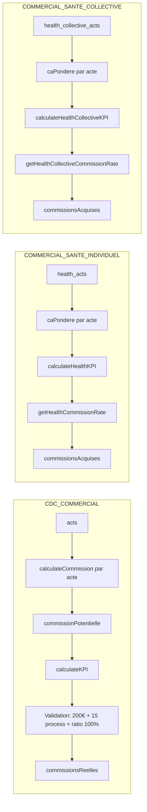

# Génération des commissions par rôle

Ce document décrit comment les commissions sont calculées et agrégées pour les trois rôles commerciaux du SaaS. Chaque rôle s’appuie sur une collection Firestore distincte et des règles de calcul dédiées.

## Vue d’ensemble

| Rôle | Collection Firestore | Logique |
|------|----------------------|--------|
| **CDC_COMMERCIAL** (commercial) | `acts` | Commission par type de contrat (AN) ; validation conditionnelle (seuil € + process + ratio). |
| **COMMERCIAL_SANTE_INDIVIDUEL** (santé ind.) | `health_acts` | CA pondéré par acte ; grille de seuils ; taux appliqué sur tout le CA. |
| **COMMERCIAL_SANTE_COLLECTIVE** (santé coll.) | `health_collective_acts` | CA pondéré (prime × coefficients) ; grille de seuils ; taux appliqué sur tout le CA. |

---

## 1. Rôle Commercial (CDC_COMMERCIAL)

**Source des données** : collection Firestore `acts`, filtrée par `userId` et `moisKey`.

**Types d’actes** :

- **AN** (Apport Nouveau) : commission par contrat selon le type de contrat.
- **M+3**, **PRETERME_AUTO**, **PRETERME_IRD** : actes « process » — pas de commission (commission potentielle = 0).

### Calcul de la commission par acte

À la création de l’acte, la commission potentielle est calculée dans `lib/firebase/acts.ts` via `calculateCommission(contratType, primeAnnuelle, montantVersement)`. Les règles sont alignées avec `lib/firebase/commission-rules.ts` et `lib/utils/kpi.ts` (`calculateCommissionForAct`).

| Type contrat | Règle |
|--------------|--------|
| AUTO_MOTO | 10 € |
| IRD_PART | 20 € |
| IRD_PRO | 20 € + 10 € par tranche de 1 000 € au-delà de 999 € (prime annuelle) |
| PJ | 30 € |
| GAV | 40 € |
| NOP_50_EUR | 10 € |
| SANTE_PREV | 50 € |
| VIE_PP | 50 € |
| VIE_PU | 1 % du montant versé |

La valeur est stockée dans le document sous le champ `commissionPotentielle` (0 pour les actes process).

### Agrégation et validation

Dans `lib/utils/kpi.ts`, la fonction `calculateKPI(acts)` :

- Somme des `commissionPotentielle` → **commissionsPotentielles**.
- Comptage des process : actes dont `kind` ∈ { M+3, PRETERME_AUTO, PRETERME_IRD } → **nbProcess**.
- Ratio : (nb AN « autres » / nb AN auto) × 100 → **ratio** (en %).

**Commissions réelles** :

- **commissionsReelles = commissionsPotentielles** si et seulement si :
  - **commissionsPotentielles ≥ 200 €**
  - **nbProcess ≥ 15**
  - **ratio ≥ 100 %**
- Sinon **commissionsReelles = 0** (commission du mois non validée).

### Affichage

- Dashboard : `app/dashboard/commissions/page.tsx` (actes du commercial connecté).
- Admin : mêmes KPI ; la section « Commissions Réelles » n’est pas affichée pour CDC_COMMERCIAL (réservée aux rôles santé).

---

## 2. Rôle Santé Individuel (COMMERCIAL_SANTE_INDIVIDUEL)

**Source des données** : collection Firestore `health_acts`, filtrée par `userId` et `moisKey`.

**Types d’actes** : AFFAIRE_NOUVELLE, REVISION, ADHESION_SALARIE, COURT_TO_AZ, AZ_TO_COURTAGE. Chaque acte a un **CA annuel** et un **coefficient** ; le **CA pondéré** = `caAnnuel × coefficient` (calculé à la création dans `lib/firebase/health-acts.ts`).

### Coefficients par type d’acte

(`lib/firebase/health-acts.ts` — `HEALTH_ACT_COEFFICIENTS`)

| Type d’acte | Coefficient |
|-------------|-------------|
| AFFAIRE_NOUVELLE | 1.0 |
| REVISION | 0.5 |
| ADHESION_SALARIE | 0.5 |
| COURT_TO_AZ | 0.75 |
| AZ_TO_COURTAGE | 0.5 |

### Grille de commission

(`lib/utils/health-kpi.ts` — `HEALTH_COMMISSION_THRESHOLDS`, `getHealthCommissionRate(caPondere)`)

| CA pondéré (€) | Taux commission |
|----------------|------------------|
| 0 – 10 000 | 0 % |
| 10 000 – 14 000 | 2 % |
| 14 000 – 18 000 | 3 % |
| 18 000 – 22 000 | 4 % |
| ≥ 22 000 | 6 % |

### Calcul des commissions

`calculateHealthKPI(acts)` dans `lib/utils/health-kpi.ts` :

- Somme des `caPondere` du mois → **caPondere** (total).
- **Taux** = taux du seuil dans lequel tombe ce total (depuis le 1er euro).
- **commissionsAcquises** = **caPondere × taux** (taux appliqué sur **toute** la production du mois).

Aucune condition de validation type process/ratio : les commissions affichées sont directement **commissionsAcquises**.

### Affichage

- Dashboard : `app/sante-individuelle/page.tsx`.
- Admin : `app/admin/sante-individuelle/page.tsx`.

---

## 3. Rôle Santé Collective (COMMERCIAL_SANTE_COLLECTIVE)

**Source des données** : collection Firestore `health_collective_acts`, filtrée par `userId` et `moisKey`.

**Types d’actes** : IND_AN_SANTE, IND_AN_PREVOYANCE, IND_AN_RETRAITE, COLL_AN_SANTE, COLL_AN_PREVOYANCE, COLL_AN_RETRAITE, COLL_ADHESION_RENFORT, REVISION, ADHESION_RENFORT, COURTAGE_TO_ALLIANZ, ALLIANZ_TO_COURTAGE. Chaque acte a une **prime** et un **CA pondéré** calculé à la création.

### Calcul du CA pondéré

(`lib/firebase/health-collective-acts.ts`)

**caPondere** = `prime × coefficientOrigine × coefficientTypeActe × coefficientCompagnie` (arrondi à l’entier).

- **Coefficient origine** : PROACTIF 1.0, REACTIF 0.5, PROSPECTION 1.25.
- **Coefficient type d’acte** : AN et COLL_ADHESION_RENFORT 1.0 ; REVISION 0.75 ; ADHESION_RENFORT, ALLIANZ_TO_COURTAGE 0.5 ; COURTAGE_TO_ALLIANZ 0.75.
- **Coefficient compagnie** : Allianz 1.2, Unim/Uniced 1.5, autres 1.0.

### Grille de commission

(`lib/utils/health-kpi.ts` — `HEALTH_COLLECTIVE_COMMISSION_THRESHOLDS`, `getHealthCollectiveCommissionRate(caPondere)`)

| CA pondéré (€) | Taux commission |
|----------------|------------------|
| 0 – 6 000 | 0 % |
| 6 000 – 10 000 | 2 % |
| 10 000 – 14 000 | 3 % |
| 14 000 – 18 000 | 4 % |
| ≥ 18 000 | 6 % |

### Calcul des commissions

`calculateHealthCollectiveKPI(acts)` dans `lib/utils/health-collective-kpi.ts` :

- Somme des `caPondere` du mois → **caPondere**.
- **Taux** = taux du seuil correspondant (depuis le 1er euro).
- **commissionsAcquises** = **caPondere × taux** (taux sur tout le CA pondéré).

### Affichage

- Dashboard : `app/sante-collective/page.tsx`.
- Admin : `app/admin/sante-collective/page.tsx`.

---

## Flux global

---

## Référence code

| Rôle | Données | Calcul commission / KPI |
|------|---------|--------------------------|
| CDC_COMMERCIAL | `lib/firebase/acts.ts` (collection `acts`) | `lib/firebase/acts.ts` `calculateCommission`, `lib/utils/kpi.ts` `calculateKPI`, `lib/firebase/commission-rules.ts` |
| COMMERCIAL_SANTE_INDIVIDUEL | `lib/firebase/health-acts.ts` (collection `health_acts`) | `lib/utils/health-kpi.ts` `calculateHealthKPI`, `getHealthCommissionRate`, `HEALTH_COMMISSION_THRESHOLDS` |
| COMMERCIAL_SANTE_COLLECTIVE | `lib/firebase/health-collective-acts.ts` (collection `health_collective_acts`) | `lib/utils/health-collective-kpi.ts` `calculateHealthCollectiveKPI`, `lib/utils/health-kpi.ts` `getHealthCollectiveCommissionRate`, `HEALTH_COLLECTIVE_COMMISSION_THRESHOLDS` |
