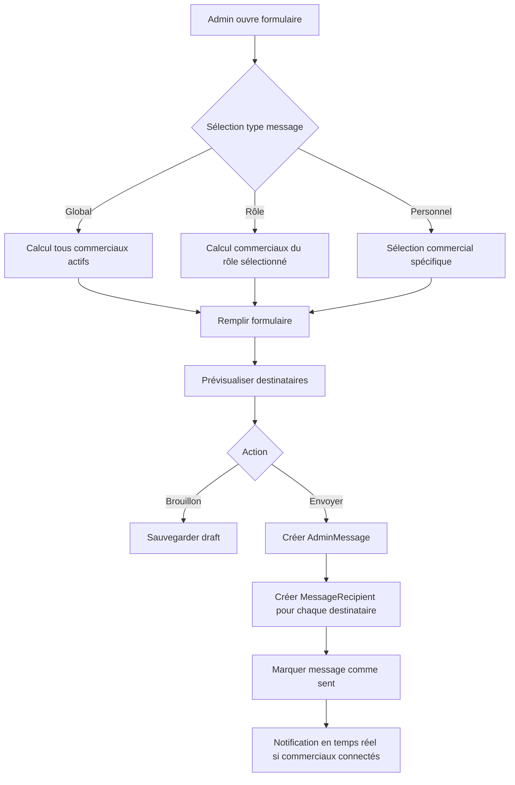
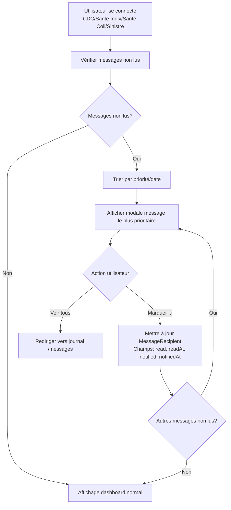

# Système de Communication Admin → Chargés de Clientèle

## Vue d'ensemble

Système de messagerie interne permettant aux administrateurs de communiquer avec les chargés de clientèle de manière ciblée ou globale.

### Rôles dans le système (5 rôles au total)

Le système distingue clairement deux types de rôles :

#### Émetteurs (uniquement)
- **`ADMINISTRATEUR`** : Seul rôle pouvant créer et envoyer des messages
  - Accès : `/admin/messages` (création, gestion, statistiques)
  - Permissions : Créer, lire, modifier, supprimer tous les messages
  - Peut voir tous les destinataires et leurs statuts de lecture

#### Récepteurs (uniquement - 4 rôles)
- **`CDC_COMMERCIAL`** : Commercial général (Auto, IARD, etc.)
- **`COMMERCIAL_SANTE_INDIVIDUEL`** : Commercial santé individuelle
- **`COMMERCIAL_SANTE_COLLECTIVE`** : Commercial santé collective
- **`GESTIONNAIRE_SINISTRE`** : Gestionnaire de sinistres

**Permissions des récepteurs** :
- Accès : `/messages` (journal personnel uniquement)
- Peuvent uniquement lire leurs propres messages reçus
- Peuvent marquer leurs messages comme lus (mise à jour limitée)
- Ne peuvent pas créer, modifier ou supprimer de messages
- Ne peuvent pas voir les messages d'autres utilisateurs

**Important** : 
- Seuls les **ADMINISTRATEUR** peuvent créer des messages
- Les 4 autres rôles sont **uniquement récepteurs**
- La distinction est garantie par les Firestore Rules et les vérifications de rôle dans le code

## Objectifs

- Permettre aux admins d'envoyer des messages selon trois types de ciblage :
  - **Global** : Tous les commerciaux, quel que soit le rôle
  - **Par rôle** : Uniquement les commerciaux ayant un rôle spécifique
  - **Personnel** : Un commercial spécifique uniquement
- Notifier les commerciaux à la connexion via une modale
- Conserver un historique des messages (journal global pour admins, journal spécifique pour commerciaux)
- Assurer la permanence des données dans Firestore

## Architecture et Structure de Données

### Collection Firestore : `admin_messages`

```typescript
interface AdminMessage {
  id: string;
  
  // Métadonnées
  createdAt: Timestamp;
  createdBy: string; // userId de l'admin
  createdByName: string; // Nom de l'admin pour affichage
  
  // Contenu
  title: string;
  content: string;
  priority: "low" | "normal" | "high" | "urgent";
  
  // Rich Media (Amélioration validée)
  images?: string[]; // URLs des images
  videos?: string[]; // URLs des vidéos (YouTube, Vimeo, ou upload)
  attachments?: string[]; // URLs des pièces jointes (Firebase Storage)
  
  // Catégories et Tags (Amélioration validée)
  category?: string; // Catégorie principale (Formation, Commission, Maintenance, etc.)
  tags?: string[]; // Tags multiples pour classification fine
  
  // Ciblage
  targetType: "global" | "role" | "personal";
  // - "global" : Tous les commerciaux, quel que soit le rôle
  // - "role" : Uniquement les commerciaux ayant un rôle spécifique
  // - "personal" : Un commercial spécifique uniquement
  targetRole?: UserRole; // Si targetType === "role"
  targetUserId?: string; // Si targetType === "personal"
  
  // Statut et suivi
  status: "draft" | "sent" | "archived" | "scheduled"; // scheduled pour messages programmés
  sentAt?: Timestamp;
  scheduledAt?: Timestamp; // Pour messages programmés
  
  // Messages épinglés (Amélioration validée)
  pinned?: boolean;
  
  // Statut de réponse (Amélioration validée)
  awaitingReply?: boolean; // Si message nécessite une réponse
  
  // Statistiques (calculées)
  totalRecipients: number;
  readCount: number;
  unreadCount: number;
  
  // Analytics (Amélioration validée)
  averageReadTime?: number; // Temps moyen de lecture en secondes
  clickCount?: number; // Nombre de clics sur les liens
  completionRate?: number; // Taux de complétion (0-1)
}
```

### Collection Firestore : `message_recipients`

```typescript
interface MessageRecipient {
  id: string;
  
  // Relations
  messageId: string; // Référence à admin_messages
  userId: string; // Référence à users
  
  // Statut de lecture
  read: boolean;
  readAt?: Timestamp;
  
  // Notification
  notified: boolean; // Si la modale a été affichée
  notifiedAt?: Timestamp;
  
  // Métadonnées
  createdAt: Timestamp;
  
  // Analytics (Amélioration validée)
  readTime?: number; // Temps de lecture en secondes
  readProgress?: number; // Progression de lecture (0-1)
}
```

### Collection Firestore : `message_replies` (Amélioration validée)

```typescript
interface MessageReply {
  id: string;
  
  // Relations
  messageId: string; // Référence à admin_messages
  userId: string; // Référence à users (le commercial qui répond)
  userName: string; // Nom du commercial pour affichage
  
  // Contenu
  content: string;
  
  // Métadonnées
  createdAt: Timestamp;
  
  // Statut
  readByAdmin?: boolean; // Si l'admin a lu la réponse
  readByAdminAt?: Timestamp;
}
```

### Indexes Firestore nécessaires

```json
{
  "indexes": [
    {
      "collectionGroup": "admin_messages",
      "queryScope": "COLLECTION",
      "fields": [
        { "fieldPath": "status", "order": "ASCENDING" },
        { "fieldPath": "createdAt", "order": "DESCENDING" }
      ]
    },
    {
      "collectionGroup": "admin_messages",
      "queryScope": "COLLECTION",
      "fields": [
        { "fieldPath": "targetType", "order": "ASCENDING" },
        { "fieldPath": "targetRole", "order": "ASCENDING" },
        { "fieldPath": "createdAt", "order": "DESCENDING" }
      ]
    },
    {
      "collectionGroup": "admin_messages",
      "queryScope": "COLLECTION",
      "fields": [
        { "fieldPath": "category", "order": "ASCENDING" },
        { "fieldPath": "createdAt", "order": "DESCENDING" }
      ]
    },
    {
      "collectionGroup": "admin_messages",
      "queryScope": "COLLECTION",
      "fields": [
        { "fieldPath": "pinned", "order": "DESCENDING" },
        { "fieldPath": "createdAt", "order": "DESCENDING" }
      ]
    },
    {
      "collectionGroup": "admin_messages",
      "queryScope": "COLLECTION",
      "fields": [
        { "fieldPath": "awaitingReply", "order": "ASCENDING" },
        { "fieldPath": "createdAt", "order": "DESCENDING" }
      ]
    },
    {
      "collectionGroup": "message_recipients",
      "queryScope": "COLLECTION",
      "fields": [
        { "fieldPath": "userId", "order": "ASCENDING" },
        { "fieldPath": "read", "order": "ASCENDING" },
        { "fieldPath": "createdAt", "order": "DESCENDING" }
      ]
    },
    {
      "collectionGroup": "message_recipients",
      "queryScope": "COLLECTION",
      "fields": [
        { "fieldPath": "messageId", "order": "ASCENDING" },
        { "fieldPath": "read", "order": "ASCENDING" }
      ]
    },
    {
      "collectionGroup": "message_replies",
      "queryScope": "COLLECTION",
      "fields": [
        { "fieldPath": "messageId", "order": "ASCENDING" },
        { "fieldPath": "createdAt", "order": "DESCENDING" }
      ]
    }
  ]
}
```

## Fonctionnalités

### 1. Envoi de messages (Admin)

#### 1.1 Message Global
- **Type** : `targetType: "global"`
- **Description** : Message envoyé à tous les commerciaux, quel que soit leur rôle
- **Interface** : Formulaire avec sélection "Message global - Tous les commerciaux"
- **Cible** : Tous les utilisateurs actifs ayant un rôle commercial (CDC_COMMERCIAL, COMMERCIAL_SANTE_INDIVIDUEL, COMMERCIAL_SANTE_COLLECTIVE, GESTIONNAIRE_SINISTRE)
- **Création** : Automatique d'un `MessageRecipient` pour chaque commercial actif

#### 1.2 Message réservé à un rôle spécifique
- **Type** : `targetType: "role"`
- **Description** : Message envoyé uniquement aux commerciaux ayant un rôle spécifique
- **Interface** : Formulaire avec sélection du rôle cible
  - CDC_COMMERCIAL
  - COMMERCIAL_SANTE_INDIVIDUEL
  - COMMERCIAL_SANTE_COLLECTIVE
  - GESTIONNAIRE_SINISTRE
- **Cible** : Tous les utilisateurs actifs ayant le rôle sélectionné
- **Création** : Automatique d'un `MessageRecipient` pour chaque commercial du rôle

#### 1.3 Message Personnel
- **Type** : `targetType: "personal"`
- **Description** : Message envoyé à un commercial spécifique uniquement
- **Interface** : Formulaire avec sélection d'un commercial (autocomplete/search)
- **Cible** : Un seul utilisateur
- **Création** : D'un seul `MessageRecipient`

#### 1.4 Champs du formulaire
- **Titre** (obligatoire, max 100 caractères)
- **Contenu** (obligatoire, texte riche supporté)
- **Priorité** (low, normal, high, urgent)
- **Type de message** :
  - Global (tous les commerciaux)
  - Réservé à un rôle (sélection du rôle)
  - Personnel (sélection d'un commercial)
- **Aperçu des destinataires** (nombre de commerciaux qui recevront le message, mis à jour dynamiquement selon le type sélectionné)

### 2. Réception et notification (Tous les rôles sauf Admin)

#### 2.1 Détection à la connexion
- Au chargement du dashboard (pour tous les rôles : CDC_COMMERCIAL, COMMERCIAL_SANTE_INDIVIDUEL, COMMERCIAL_SANTE_COLLECTIVE, GESTIONNAIRE_SINISTRE), vérifier s'il existe des messages non lus
- Si oui, afficher une modale avec le message le plus prioritaire ou le plus récent

#### 2.2 Modale de notification
- **Design** : Modale centrée, non-dismissible (doit être lue)
- **Contenu** :
  - Badge de priorité (couleur selon priorité)
  - Titre du message
  - Contenu du message (scrollable si long)
  - Date d'envoi
  - Nom de l'expéditeur
- **Actions** :
  - Bouton "Marquer comme lu" (ferme la modale et marque comme lu)
  - Bouton "Voir tous mes messages" (redirige vers le journal)
  - Si plusieurs messages : "Message suivant" / "Message précédent"

#### 2.3 Comportement
- La modale s'affiche automatiquement à la connexion si messages non lus
- Une fois marquée comme lue, le `MessageRecipient` est mis à jour (`read: true`, `readAt: timestamp`)
- Le `notified` est mis à `true` pour éviter les doublons

### 3. Journal des messages

#### 3.1 Journal Admin (Global)
- **Route** : `/admin/messages`
- **Fonctionnalités** :
  - Liste de tous les messages envoyés (tous statuts)
  - Filtres :
    - Par statut (draft, sent, archived)
    - Par type de message (global, role, personal)
    - Par priorité
    - Par date
  - Statistiques par message :
    - Nombre total de destinataires
    - Nombre de lecteurs
    - Taux de lecture
  - Actions :
    - Créer un nouveau message
    - Voir les détails d'un message
    - Archiver un message
    - Supprimer un brouillon
    - Voir la liste des destinataires et leur statut de lecture

#### 3.2 Journal Utilisateur (Spécifique - Tous les rôles sauf Admin)
- **Route** : `/messages` (accessible depuis le dashboard)
- **Accessible par** : CDC_COMMERCIAL, COMMERCIAL_SANTE_INDIVIDUEL, COMMERCIAL_SANTE_COLLECTIVE, GESTIONNAIRE_SINISTRE
- **Fonctionnalités** :
  - Liste des messages reçus par l'utilisateur connecté (selon son rôle)
  - Filtres :
    - Lu / Non lu
    - Par priorité
    - Par date
  - Badge de notification (nombre de messages non lus)
  - Actions :
    - Marquer comme lu / non lu
    - Voir les détails d'un message
    - Recherche dans les messages

## Expérience Utilisateur (UI/UX)

### Interface Admin

#### Page de création de message
```
┌─────────────────────────────────────────────────┐
│  Nouveau message                                │
├─────────────────────────────────────────────────┤
│                                                  │
│  Type de message                                │
│  ○ Global (tous les commerciaux)               │
│  ● Réservé à un rôle                            │
│  ○ Personnel                                    │
│                                                  │
│  [Sélectionner un rôle ▼]                      │
│  CDC Commercial                                 │
│                                                  │
│  Aperçu : 12 commerciaux recevront ce message  │
│                                                  │
│  ─────────────────────────────────────────────  │
│                                                  │
│  Titre *                                        │
│  [________________________________]             │
│                                                  │
│  Priorité                                       │
│  [Faible] [Normal] [Élevée] [Urgente]         │
│                                                  │
│  Contenu *                                      │
│  [________________________________]             │
│  [________________________________]             │
│  [________________________________]             │
│                                                  │
│  [Enregistrer comme brouillon] [Envoyer]        │
└─────────────────────────────────────────────────┘
```

#### Page de liste des messages (Admin)
```
┌─────────────────────────────────────────────────┐
│  Messages envoyés                    [+ Nouveau] │
├─────────────────────────────────────────────────┤
│  [Filtres: Statut ▼] [Priorité ▼] [Date ▼]     │
├─────────────────────────────────────────────────┤
│                                                  │
│  📢 Nouvelle grille de commissions             │
│  Envoyé le 15/01/2025 à 14:30                   │
│  Tous les commerciaux • 12 destinataires       │
│  📊 10 lus (83%) • 2 non lus                   │
│  [Voir détails] [Archiver]                      │
│                                                  │
│  ⚠️ Maintenance prévue cette semaine            │
│  Envoyé le 14/01/2025 à 09:00                   │
│  CDC Commercial • 5 destinataires              │
│  📊 5 lus (100%)                                │
│  [Voir détails] [Archiver]                      │
│                                                  │
└─────────────────────────────────────────────────┘
```

### Interface Commercial

#### Modale de notification (à la connexion)
```
┌─────────────────────────────────────────────────┐
│  ⚠️ Message important                           │
├─────────────────────────────────────────────────┤
│                                                  │
│  Nouvelle grille de commissions                 │
│                                                  │
│  Bonjour,                                       │
│                                                  │
│  La grille de commissions a été mise à jour...  │
│  [contenu du message...]                        │
│                                                  │
│  Envoyé par : Admin Principal                   │
│  Le 15/01/2025 à 14:30                          │
│                                                  │
│  [Marquer comme lu] [Voir tous mes messages]    │
│                                                  │
└─────────────────────────────────────────────────┘
```

#### Page de liste des messages (Commercial)
```
┌─────────────────────────────────────────────────┐
│  Mes messages                    🔴 2 non lus   │
├─────────────────────────────────────────────────┤
│  [Filtres: Non lus ▼] [Priorité ▼] [Date ▼]    │
├─────────────────────────────────────────────────┤
│                                                  │
│  🔴 Nouvelle grille de commissions             │
│  ⚠️ Urgent • 15/01/2025                         │
│  [Marquer comme lu]                             │
│                                                  │
│  ⚠️ Maintenance prévue cette semaine            │
│  📌 Normal • 14/01/2025                         │
│  [Marquer comme lu]                             │
│                                                  │
│  ✓ Rappel : Formation vendredi                 │
│  📌 Normal • 10/01/2025                         │
│  [Marquer comme non lu]                          │
│                                                  │
└─────────────────────────────────────────────────┘
```

### Indicateurs visuels

- **Badge de notification** : Nombre de messages non lus dans la sidebar
- **Icônes de priorité** :
  - 🔴 Urgent (rouge)
  - ⚠️ Élevée (orange)
  - 📌 Normal (bleu)
  - ℹ️ Faible (gris)
- **Statut de lecture** :
  - 🔴 Non lu (rouge)
  - ✓ Lu (vert/gris)

## Workflow

### Workflow d'envoi (Admin)



### Workflow de réception (Tous les rôles sauf Admin)



## Sécurité et Permissions

### Firestore Rules

**Distinction claire des permissions** :
- **ADMINISTRATEUR** : Peut créer, lire, modifier et supprimer tous les messages
- **Autres rôles** (CDC_COMMERCIAL, COMMERCIAL_SANTE_INDIVIDUEL, COMMERCIAL_SANTE_COLLECTIVE, GESTIONNAIRE_SINISTRE) : Peuvent uniquement lire leurs propres messages et les marquer comme lus

```javascript
// admin_messages
match /admin_messages/{messageId} {
  // Lecture : ADMINISTRATEUR uniquement
  // Les autres rôles n'ont pas accès direct aux messages, uniquement via message_recipients
  allow read: if isAdmin();
  
  // Écriture : ADMINISTRATEUR uniquement
  allow create: if isAdmin() && 
                   request.resource.data.createdBy == request.auth.uid;
  allow update: if isAdmin();
  allow delete: if isAdmin();
}

// message_recipients
match /message_recipients/{recipientId} {
  // Lecture : ADMINISTRATEUR (voit tout) OU le destinataire lui-même (voit ses propres messages)
  allow read: if isAdmin() || 
                 resource.data.userId == request.auth.uid;
  
  // Écriture :
  // - ADMINISTRATEUR : peut tout faire
  // - Destinataire : peut SEULEMENT marquer comme lu (champs limités)
  allow create: if isAdmin(); // Seul l'admin crée les recipients lors de l'envoi
  allow update: if isAdmin() || 
                   (resource.data.userId == request.auth.uid && 
                    // Le destinataire peut SEULEMENT modifier : read, readAt, notified, notifiedAt, readTime, readProgress
                    request.resource.data.diff(resource.data).affectedKeys().hasOnly(['read', 'readAt', 'notified', 'notifiedAt', 'readTime', 'readProgress']));
  allow delete: if isAdmin(); // Seul l'admin peut supprimer
}

// message_replies (Amélioration validée)
match /message_replies/{replyId} {
  // Lecture : ADMINISTRATEUR (voit tout) OU l'auteur de la réponse OU les destinataires du message original
  allow read: if isAdmin() || 
                 resource.data.userId == request.auth.uid ||
                 // Les destinataires du message peuvent voir les réponses
                 (exists(/databases/$(database)/documents/admin_messages/$(resource.data.messageId)) &&
                  exists(/databases/$(database)/documents/message_recipients/$(request.auth.uid + '_' + resource.data.messageId)));
  
  // Écriture :
  // - ADMINISTRATEUR : peut tout faire
  // - Utilisateurs (récepteurs) : peuvent créer des réponses
  // - Auteur : peut modifier sa propre réponse
  allow create: if !isAdmin() && // Seuls les non-admins peuvent répondre
                   request.resource.data.userId == request.auth.uid;
  allow update: if isAdmin() || 
                   (resource.data.userId == request.auth.uid && 
                    // L'auteur peut modifier sa réponse (champs limités)
                    request.resource.data.diff(resource.data).affectedKeys().hasOnly(['content']));
  allow delete: if isAdmin() || resource.data.userId == request.auth.uid;
}
```

## Permanence des Données

### Stratégie de conservation

- **Messages envoyés** : Conservés indéfiniment (archivage possible, pas de suppression)
- **Brouillons** : Conservés 30 jours, puis suppression automatique
- **MessageRecipients** : Conservés indéfiniment pour historique
- **Statistiques** : Calculées en temps réel, pas de stockage séparé

### Archivage

- Les admins peuvent archiver des messages (statut `archived`)
- Les messages archivés restent visibles dans le journal avec filtre
- Pas de suppression définitive (audit trail)

## Plan de Développement

### Phase 1 : Fondations (Base fonctionnelle)

#### 1.1 Types et Interfaces TypeScript
**Fichier** : `types/message.ts`

```typescript
// Interfaces de base
- AdminMessage (avec targetType: "global" | "role" | "personal")
- MessageRecipient
- MessageTemplate (pour Phase 3)
- MessageStatistics (pour Phase 4)
- UserMessagePreferences (pour Phase 5)
```

#### 1.2 Firebase Functions - CRUD de base
**Fichier** : `lib/firebase/messages.ts`

**Fonctions à implémenter** :
- `createMessage()` : Créer un message et ses recipients (ADMIN uniquement)
- `getMessagesByUser()` : Récupérer les messages d'un utilisateur (tous rôles sauf admin)
- `getAllMessages()` : Récupérer tous les messages (ADMIN uniquement)
- `markAsRead()` : Marquer un message comme lu (utilisateur récepteur uniquement)
- `getUnreadCount()` : Compter les messages non lus (tous rôles sauf admin)
- `getRecipientsByMessage()` : Récupérer les destinataires d'un message (ADMIN uniquement)
- `updateMessageStats()` : Mettre à jour les statistiques (ADMIN uniquement)
- `getUsersByRole()` : Récupérer les utilisateurs actifs d'un rôle spécifique (pour calcul des destinataires)

#### 1.3 Hooks de base
**Fichiers** :
- `lib/hooks/use-messages.ts` : Hook pour récupérer les messages (comportement différent selon rôle : admin voit tout, autres voient leurs messages)
- `lib/hooks/use-unread-messages.ts` : Hook pour messages non lus avec cache (tous rôles sauf admin)
- `lib/hooks/use-message-recipients.ts` : Hook pour les destinataires (ADMIN uniquement)
- `lib/hooks/use-create-message.ts` : Hook pour créer un message (ADMIN uniquement)

#### 1.4 Composants UI de base
**Fichiers** :
- `components/messages/message-modal.tsx` : Modale de notification (version basique)
- `components/messages/message-form.tsx` : Formulaire de création (version basique)
- `components/messages/message-list.tsx` : Liste des messages (version basique)
- `components/messages/message-card.tsx` : Carte de message
- `components/messages/message-badge.tsx` : Badge de notification dans sidebar

#### 1.5 Pages de base
**Fichiers** :
- `app/admin/messages/page.tsx` : Journal admin (ADMIN uniquement, version basique)
- `app/messages/page.tsx` : Journal utilisateur (tous rôles sauf admin : CDC_COMMERCIAL, COMMERCIAL_SANTE_INDIVIDUEL, COMMERCIAL_SANTE_COLLECTIVE, GESTIONNAIRE_SINISTRE, version basique)

#### 1.6 Firestore Rules
**Fichier** : `firestore.rules`
- Ajouter les rules pour `admin_messages` et `message_recipients`

#### 1.7 Indexes Firestore
**Fichier** : `firestore.indexes.json`
- Ajouter tous les indexes nécessaires

**Livrables Phase 1** :
- Système fonctionnel de base
- Envoi/réception de messages
- Modale de notification basique
- Listes de messages basiques

---

### Phase 2 : Améliorations UI/UX - Modale et Notifications

#### 2.1 Modale de Notification Améliorée
**Fichier** : `components/messages/message-modal.tsx` (amélioration)

**Fonctionnalités** :
- [ ] Animation d'entrée avec framer-motion (slide-in + fade-in)
- [ ] Effets visuels selon priorité (bordure pulsante pour urgent)
- [ ] Indicateur de progression "Message 1/3" avec barre de progression
- [ ] Navigation entre messages (boutons précédent/suivant)
- [ ] Support markdown basique (rendu avec react-markdown)
- [ ] Détection automatique des URLs (liens cliquables)
- [ ] Date relative ("Il y a 2 heures")
- [ ] Focus trap (impossible de sortir avec Tab)
- [ ] ARIA labels complets
- [ ] Responsive : plein écran sur mobile
- [ ] Swipe pour navigation sur mobile (react-swipeable)

#### 2.2 Badge de Notification Amélioré
**Fichier** : `components/messages/message-badge.tsx` (amélioration)

**Fonctionnalités** :
- [ ] Animation pulsante si messages non lus (framer-motion)
- [ ] Tooltip au survol avec nombre de messages
- [ ] Couleur dynamique selon priorité (rouge/orange/bleu)
- [ ] Badge dans le menu navigation
- [ ] Badge persistant jusqu'à lecture

#### 2.3 Notification Toast
**Fichier** : `components/messages/message-toast.tsx` (nouveau)

**Fonctionnalités** :
- [ ] Toast discret en bas à droite si commercial connecté
- [ ] Clic sur toast ouvre la modale
- [ ] Auto-dismiss après 5 secondes (sauf urgent)
- [ ] Animation d'entrée/sortie

**Livrables Phase 2** :
- Modale avec animations et effets visuels
- Badge animé et intelligent
- Système de toast pour notifications

---

### Phase 3 : Améliorations UI/UX - Formulaire et Éditeur

#### 3.1 Formulaire de Création Amélioré
**Fichier** : `components/messages/message-form.tsx` (amélioration)

**Fonctionnalités** :
- [ ] Compteur de destinataires dynamique (mise à jour temps réel)
- [ ] Dropdown expandable avec liste des destinataires (avec recherche)
- [ ] Validation visuelle (badge vert si valide)
- [ ] Indicateur de caractères restants pour titre (100 max)
- [ ] Compteur de mots pour contenu
- [ ] Modal de confirmation avant envoi avec récapitulatif
- [ ] Historique des brouillons (liste déroulante)

#### 3.2 Éditeur de Contenu
**Fichier** : `components/messages/message-editor.tsx` (nouveau)

**Fonctionnalités** :
- [ ] Toolbar markdown (gras, italique, listes, liens)
- [ ] Onglets "Édition" / "Aperçu" avec rendu markdown
- [ ] Sauvegarde automatique toutes les 30 secondes (brouillon)
- [ ] Indicateur de sauvegarde ("Sauvegardé il y a X secondes")

#### 3.3 Templates de Messages
**Fichier** : `lib/firebase/message-templates.ts` (nouveau)
**Fichier** : `components/messages/template-selector.tsx` (nouveau)

**Fonctionnalités** :
- [ ] Collection Firestore `message_templates`
- [ ] Boutons rapides pour templates récurrents
- [ ] Variables dynamiques ({nom_commercial}, {date}, etc.)
- [ ] CRUD templates (créer, modifier, supprimer)
- [ ] Bibliothèque de templates dans l'interface admin

#### 3.4 Messages Programmés
**Fichier** : `lib/firebase/scheduled-messages.ts` (nouveau)

**Fonctionnalités** :
- [ ] Champ `scheduledAt` dans AdminMessage
- [ ] Statut "scheduled" pour messages programmés
- [ ] Interface de programmation (date/heure picker)
- [ ] Cron job ou Cloud Function pour envoi programmé
- [ ] Annulation de message programmé

**Livrables Phase 3** :
- Formulaire enrichi avec éditeur markdown
- Système de templates
- Messages programmés

---

### Phase 4 : Améliorations UI/UX - Listes et Statistiques

#### 4.1 Liste Admin Améliorée
**Fichier** : `app/admin/messages/page.tsx` (amélioration)

**Fonctionnalités** :
- [ ] Toggle vue grille/liste
- [ ] Tri avancé (taux de lecture, destinataires, date)
- [ ] Filtres combinés avec badges de filtre actifs
- [ ] Recherche full-text (titre + contenu)
- [ ] Pagination avec lazy loading (20 par page)
- [ ] Export CSV/Excel des statistiques
- [ ] Graphiques de statistiques (recharts)
  - Graphique en barres : Taux de lecture par message
  - Graphique temporel : Messages envoyés par jour/semaine

#### 4.2 Liste Commercial Améliorée
**Fichier** : `app/messages/page.tsx` (amélioration)

**Fonctionnalités** :
- [ ] Toggle vue compacte/étendue
- [ ] Marquage groupé ("Marquer tout comme lu")
- [ ] Filtres rapides (chips : "Non lus", "Urgents", "Cette semaine")
- [ ] Recherche dans messages reçus
- [ ] Tri personnalisé (non lus en premier, puis priorité)
- [ ] Virtual scrolling pour listes longues (react-window)

#### 4.3 Cartes de Messages Améliorées
**Fichier** : `components/messages/message-card.tsx` (amélioration)

**Fonctionnalités** :
- [ ] Hover effect (élévation de la carte)
- [ ] Barre colorée sur côté gauche (indicateur priorité)
- [ ] Icônes contextuelles (épinglé, rappel, pièce jointe)
- [ ] Statut de lecture visuel (bordure épaisse si non lu)
- [ ] Animation au clic

#### 4.4 Dashboard de Statistiques
**Fichier** : `app/admin/messages/statistics/page.tsx` (nouveau)

**Fonctionnalités** :
- [ ] Métriques globales :
  - Messages envoyés par période
  - Taux de lecture moyen
  - Temps moyen de lecture
  - Messages les plus lus
- [ ] Graphiques interactifs (recharts)
- [ ] Filtres par période (jour, semaine, mois, année)

**Livrables Phase 4** :
- Listes améliorées avec filtres et recherche
- Dashboard de statistiques
- Graphiques interactifs

---

### Phase 5 : Fonctionnalités Avancées

#### 5.1 Messages Épinglés
**Fichier** : `lib/firebase/messages.ts` (ajout fonction)

**Fonctionnalités** :
- [ ] Champ `pinned: boolean` dans AdminMessage
- [ ] Bouton "Épingler" dans interface admin
- [ ] Affichage prioritaire (toujours en haut)
- [ ] Badge spécial 📌 pour messages épinglés
- [ ] Limite de 5 messages épinglés maximum

#### 5.2 Rappels Automatiques
**Fichier** : `lib/utils/message-reminders.ts` (nouveau)

**Fonctionnalités** :
- [ ] Vérification quotidienne des messages non lus > 24h
- [ ] Rappel discret (toast ou badge)
- [ ] Paramètre utilisateur pour fréquence des rappels
- [ ] Notification sonore optionnelle (paramètre utilisateur)

#### 5.3 Préférences Utilisateur
**Fichier** : `lib/firebase/user-preferences.ts` (nouveau)
**Fichier** : `app/settings/messages/page.tsx` (nouveau)

**Fonctionnalités** :
- [ ] Collection Firestore `user_message_preferences`
- [ ] Paramètres :
  - Activer/désactiver notifications sonores
  - Fréquence des rappels
  - Préférence d'affichage (liste/grille)
- [ ] Page de paramètres accessible depuis profil

#### 5.4 Filtres Sauvegardés
**Fichier** : `lib/firebase/saved-filters.ts` (nouveau)

**Fonctionnalités** :
- [ ] Sauvegarder des combinaisons de filtres
- [ ] Vues personnalisées avec filtres pré-configurés
- [ ] Interface pour créer/gérer les vues sauvegardées

#### 5.5 Système de Réponses (Amélioration Validée)
**Fichier** : `lib/firebase/message-replies.ts` (nouveau)
**Fichier** : `components/messages/message-reply.tsx` (nouveau)

**Fonctionnalités** :
- [ ] Collection Firestore `message_replies`
- [ ] Interface pour répondre aux messages (commerciaux)
- [ ] Thread de conversation (affichage des réponses)
- [ ] Notifications admin quand un commercial répond
- [ ] Statut "En attente de réponse" sur les messages
- [ ] Badge/indicateur visuel pour messages nécessitant une réponse
- [ ] Filtre "En attente" dans l'interface admin

#### 5.6 Rich Media et Catégories (Améliorations Validées)
**Fichier** : `lib/firebase/message-attachments.ts` (nouveau)
**Fichier** : `components/messages/message-attachments.tsx` (nouveau)

**Fonctionnalités** :
- [ ] Support d'images intégrées (upload Firebase Storage)
- [ ] Support de vidéos (YouTube, Vimeo, ou upload)
- [ ] Support de pièces jointes (PDF, Excel, etc.)
- [ ] Galerie d'images dans les messages
- [ ] Catégories de messages (Formation, Commission, Maintenance, etc.)
- [ ] Tags multiples pour classification fine
- [ ] Filtrage par catégorie dans les listes

#### 5.7 Automatisation (Amélioration Validée)
**Fichier** : `lib/firebase/recurring-messages.ts` (nouveau)
**Fichier** : `lib/firebase/message-triggers.ts` (nouveau)

**Fonctionnalités** :
- [ ] Messages récurrents (hebdomadaire, mensuel)
- [ ] Interface pour créer/gérer les messages récurrents
- [ ] Déclencheurs automatiques basés sur événements système
- [ ] Workflows automatisés (séquences de messages avec délais)
- [ ] Cron job ou Cloud Function pour exécution automatique

#### 5.8 Analytics Avancés (Amélioration Validée)
**Fichier** : `lib/utils/message-analytics.ts` (nouveau)

**Fonctionnalités** :
- [ ] Mesure du temps de lecture par message
- [ ] Taux de clic sur les liens
- [ ] Heatmap de lecture (quelles parties sont les plus lues)
- [ ] Taux de complétion (messages lus jusqu'au bout)
- [ ] Heure/jour optimal de lecture
- [ ] Temps de réaction (entre envoi et lecture)
- [ ] Patterns de lecture par rôle
- [ ] Comparaison périodique des performances
- [ ] Export PDF des statistiques

**Livrables Phase 5** :
- Messages épinglés
- Système de rappels
- Préférences utilisateur
- Filtres sauvegardés
- Système de réponses
- Rich media et catégories
- Automatisation
- Analytics avancés

---

### Phase 6 : Accessibilité et Performance

#### 6.1 Accessibilité
**Fichiers** : Tous les composants

**Fonctionnalités** :
- [ ] Navigation clavier complète (Tab order logique)
- [ ] Raccourcis clavier :
  - `M` : Ouvrir mes messages
  - `N` : Nouveau message (admin)
  - `Esc` : Fermer (si autorisé)
- [ ] Focus visible sur tous les éléments interactifs
- [ ] ARIA labels complets
- [ ] Annonces dynamiques pour lecteurs d'écran
- [ ] Landmarks sémantiques
- [ ] Contraste WCAG AA minimum

#### 6.2 Performance
**Fichiers** : Hooks et composants

**Fonctionnalités** :
- [ ] Lazy loading des messages (20 par page)
- [ ] Virtual scrolling pour listes longues (react-window)
- [ ] Cache intelligent côté client (localStorage)
- [ ] Real-time updates avec Firestore onSnapshot (optimisé)
- [ ] Debounce pour recherche
- [ ] Memoization des composants lourds (React.memo, useMemo)

#### 6.3 Performance et Scalabilité (Amélioration Validée)
**Fichiers** : Infrastructure et optimisations

**Fonctionnalités** :
- [ ] CDN pour médias (images/vidéos)
- [ ] Compression des messages longs
- [ ] Cache distribué pour haute disponibilité
- [ ] Monitoring des métriques de performance
- [ ] Alertes système en cas de problème
- [ ] Dashboard de santé système

#### 6.3 Optimisations Mobile
**Fichiers** : Composants responsive

**Fonctionnalités** :
- [ ] Modale plein écran sur mobile
- [ ] Swipe gestures pour navigation (react-swipeable)
- [ ] Actions rapides (swipe left pour marquer lu)
- [ ] Filtres en drawer latéral sur mobile
- [ ] Boutons tactiles (taille minimale 44x44px)
- [ ] Cards empilées optimisées pour mobile

**Livrables Phase 6** :
- Accessibilité complète
- Performance optimisée
- Expérience mobile fluide

---

### Phase 7 : Tests et Documentation

#### 7.1 Tests
**Fichiers** : `__tests__/messages/`

**Tests à implémenter** :
- [ ] Tests unitaires des fonctions Firebase
- [ ] Tests des hooks
- [ ] Tests d'intégration des workflows
- [ ] Tests E2E des scénarios principaux
- [ ] Tests d'accessibilité (axe-core)

#### 7.2 Documentation
**Fichiers** :
- [ ] Documentation des composants (JSDoc)
- [ ] Guide d'utilisation pour admins
- [ ] Guide d'utilisation pour commerciaux
- [ ] Documentation technique (architecture, décisions)

**Livrables Phase 7** :
- Suite de tests complète
- Documentation utilisateur et technique

---

## Structure des Fichiers (Complète)

### Types
```
types/
  └── message.ts                    # Interfaces AdminMessage, MessageRecipient, etc.
```

### Firebase Functions
```
lib/firebase/
  ├── messages.ts                   # CRUD messages de base
  ├── message-templates.ts          # Gestion des templates
  ├── scheduled-messages.ts         # Messages programmés
  ├── recurring-messages.ts         # Messages récurrents (amélioration validée)
  ├── message-triggers.ts           # Déclencheurs automatiques (amélioration validée)
  ├── message-replies.ts            # Système de réponses (amélioration validée)
  ├── message-attachments.ts        # Gestion des pièces jointes (amélioration validée)
  ├── message-analytics.ts          # Analytics avancés (amélioration validée)
  ├── user-preferences.ts           # Préférences utilisateur
  └── saved-filters.ts              # Filtres sauvegardés
```

### Hooks
```
lib/hooks/
  ├── use-messages.ts               # Hook messages
  ├── use-unread-messages.ts        # Hook messages non lus
  ├── use-message-recipients.ts     # Hook destinataires (admin)
  └── use-message-stats.ts          # Hook statistiques
```

### Utilitaires
```
lib/utils/
  ├── message-formatters.ts         # Formatage dates, markdown, etc.
  ├── message-reminders.ts          # Logique de rappels
  ├── message-validators.ts         # Validation formulaires
  └── message-analytics.ts          # Calculs analytics (temps lecture, etc.)
```

### Composants UI
```
components/messages/
  ├── message-modal.tsx             # Modale de notification (améliorée)
  ├── message-form.tsx              # Formulaire de création (amélioré)
  ├── message-editor.tsx            # Éditeur markdown
  ├── message-list.tsx              # Liste des messages
  ├── message-card.tsx              # Carte de message (améliorée)
  ├── message-badge.tsx             # Badge de notification
  ├── message-toast.tsx             # Toast de notification
  ├── message-statistics.tsx       # Composant statistiques
  ├── message-filters.tsx          # Composant filtres
  ├── template-selector.tsx        # Sélecteur de templates
  ├── scheduled-message-dialog.tsx # Dialog programmation
  ├── message-reply.tsx            # Composant réponse (amélioration validée)
  ├── message-replies-list.tsx     # Liste des réponses (amélioration validée)
  ├── message-attachments.tsx       # Gestion pièces jointes (amélioration validée)
  ├── message-category-selector.tsx # Sélecteur catégories/tags (amélioration validée)
  └── message-analytics-chart.tsx   # Graphiques analytics (amélioration validée)
```

### Pages
```
app/
  ├── admin/
  │   └── messages/
  │       ├── page.tsx              # Journal admin (ADMIN uniquement)
  │       ├── new/
  │       │   └── page.tsx         # Création message (ADMIN uniquement)
  │       ├── [id]/
  │       │   └── page.tsx         # Détails message (ADMIN uniquement)
  │       └── statistics/
  │           └── page.tsx         # Dashboard statistiques (ADMIN uniquement)
  ├── messages/
  │   └── page.tsx                 # Journal utilisateur (tous rôles sauf admin)
  └── settings/
      └── messages/
          └── page.tsx              # Paramètres messages (tous rôles)
```

### Tests
```
__tests__/
  └── messages/
      ├── messages.test.ts
      ├── message-modal.test.tsx
      ├── message-form.test.tsx
      └── message-hooks.test.ts
```

---

## Ordre de Priorité de Développement

### Sprint 1 (Phase 1) - Base fonctionnelle
1. Types TypeScript
2. Firebase Functions de base
3. Hooks de base
4. Composants UI de base
5. Pages de base
6. Firestore Rules et Indexes

### Sprint 2 (Phase 2) - Modale et notifications
1. Modale améliorée avec animations
2. Badge de notification amélioré
3. Système de toast

### Sprint 3 (Phase 3) - Formulaire et éditeur
1. Formulaire amélioré
2. Éditeur markdown
3. Templates de messages
4. Messages programmés

### Sprint 4 (Phase 4) - Listes et statistiques
1. Listes améliorées
2. Dashboard de statistiques
3. Graphiques interactifs

### Sprint 5 (Phase 5) - Fonctionnalités avancées
1. Messages épinglés
2. Rappels automatiques
3. Préférences utilisateur
4. Filtres sauvegardés

### Sprint 6 (Phase 6) - Accessibilité et performance
1. Accessibilité complète
2. Optimisations performance
3. Expérience mobile

### Sprint 7 (Phase 7) - Tests et documentation
1. Tests complets
2. Documentation

---

## Dépendances Externes

### Packages npm à installer
```json
{
  "react-markdown": "^9.0.0",           // Rendu markdown
  "react-swipeable": "^7.0.0",          // Swipe gestures mobile
  "react-window": "^1.8.10",            // Virtual scrolling
  "date-fns": "^3.0.0",                 // Formatage dates (déjà présent)
  "framer-motion": "^11.0.0",           // Animations (déjà présent)
  "recharts": "^2.10.0",                // Graphiques (déjà présent)
  "xlsx": "^0.18.0",                    // Export Excel
  "papaparse": "^5.4.0"                 // Export CSV
}
```

### Services Firebase
- Firestore (déjà configuré)
- Cloud Functions (pour messages programmés, optionnel)
- Cloud Messaging (pour notifications push, optionnel futur)

## Améliorations UI/UX Proposées

### 1. Modale de Notification (Améliorations)

#### 1.1 Design et Animation
- **Animation d'entrée** : Slide-in depuis le haut avec fade-in (framer-motion)
- **Effet de priorité visuelle** :
  - Urgent : Bordure rouge pulsante, icône clignotante
  - Élevée : Bordure orange avec animation subtile
  - Normal : Bordure bleue standard
  - Faible : Bordure grise discrète
- **Indicateur de progression** : Si plusieurs messages, afficher "Message 1/3" avec barre de progression
- **Bouton "Message suivant"** : Visible uniquement s'il y a plusieurs messages non lus

#### 1.2 Contenu Enrichi
- **Prévisualisation du contenu** : Si message long, afficher les 3 premières lignes + "Lire la suite"
- **Mise en forme** : Support markdown basique (gras, italique, listes)
- **Liens cliquables** : Détection automatique des URLs
- **Date relative** : "Il y a 2 heures" au lieu de "15/01/2025 à 14:30"

#### 1.3 Accessibilité
- **Focus trap** : Impossible de sortir de la modale avec Tab
- **Escape désactivé** : Pas de fermeture avec Escape (message important)
- **ARIA labels** : Labels appropriés pour lecteurs d'écran
- **Contraste** : Respect WCAG AA minimum

### 2. Formulaire de Création (Admin)

#### 2.1 Aperçu en Temps Réel
- **Compteur de destinataires dynamique** : Mise à jour en temps réel selon le type sélectionné
- **Liste des destinataires** : Dropdown expandable montrant la liste complète (avec recherche)
- **Validation visuelle** : 
  - Badge vert si formulaire valide
  - Indicateur de caractères restants pour le titre (100 max)
  - Compteur de mots pour le contenu

#### 2.2 Éditeur de Contenu
- **Toolbar markdown** : Boutons pour gras, italique, listes, liens
- **Prévisualisation** : Onglet "Édition" / "Aperçu" pour voir le rendu
- **Templates** : Boutons rapides pour messages récurrents
  - "Maintenance prévue"
  - "Nouvelle formation"
  - "Rappel important"
- **Sauvegarde automatique** : Auto-save toutes les 30 secondes (brouillon)

#### 2.3 Expérience Utilisateur
- **Confirmation avant envoi** : Modal de confirmation avec récapitulatif
  - Type de message
  - Nombre de destinataires
  - Priorité
  - Aperçu du contenu
- **Bouton "Programmer l'envoi"** : Option pour envoyer plus tard (date/heure)
- **Historique des brouillons** : Liste des brouillons sauvegardés

### 3. Liste des Messages (Améliorations)

#### 3.1 Vue Admin
- **Vue en grille/Liste** : Toggle pour changer la vue
- **Tri avancé** :
  - Par taux de lecture (croissant/décroissant)
  - Par nombre de destinataires
  - Par date d'envoi
- **Filtres combinés** : Plusieurs filtres simultanés avec badges de filtre actifs
- **Recherche full-text** : Recherche dans titre et contenu
- **Graphiques de statistiques** :
  - Graphique en barres : Taux de lecture par message
  - Graphique temporel : Messages envoyés par jour/semaine
- **Export** : Export CSV/Excel des statistiques

#### 3.2 Vue Commercial
- **Vue compacte/Étendue** : Toggle pour afficher plus/moins de détails
- **Marquage groupé** : "Marquer tout comme lu" avec confirmation
- **Filtres rapides** :
  - Boutons chips : "Non lus", "Urgents", "Cette semaine", "Ce mois"
- **Recherche** : Recherche dans ses messages reçus
- **Tri personnalisé** : Par défaut, non lus en premier, puis par priorité

### 4. Indicateurs Visuels (Améliorations)

#### 4.1 Badge de Notification dans la Sidebar
- **Animation pulsante** : Si messages non lus, animation subtile
- **Tooltip au survol** : Afficher "X messages non lus"
- **Couleur selon priorité** :
  - Rouge si message urgent non lu
  - Orange si message élevé non lu
  - Bleu si messages normaux uniquement
- **Badge dans le menu** : Badge sur l'item "Messages" de la navigation

#### 4.2 Cartes de Messages
- **Hover effect** : Élévation de la carte au survol
- **Indicateur de priorité** : Barre colorée sur le côté gauche de la carte
- **Icônes contextuelles** :
  - 📌 Épinglé (si message important)
  - 🔔 Rappel (si message programmé)
  - 📎 Pièce jointe (si supporté)
- **Statut de lecture visuel** :
  - Carte non lue : Bordure épaisse colorée
  - Carte lue : Bordure fine grise, opacité réduite

### 5. Expérience Mobile

#### 5.1 Modale Responsive
- **Plein écran sur mobile** : Modale prend tout l'écran sur petits écrans
- **Swipe pour navigation** : Swipe gauche/droite pour changer de message
- **Boutons tactiles** : Boutons plus grands pour faciliter le tap

#### 5.2 Liste Responsive
- **Cards empilées** : Vue verticale optimisée pour mobile
- **Actions rapides** : Swipe left pour "Marquer comme lu"
- **Filtres en drawer** : Filtres dans un drawer latéral sur mobile

### 6. Notifications et Rappels

#### 6.1 Notification Toast
- **Toast discret** : Si commercial déjà connecté, toast en bas à droite
- **Action rapide** : Clic sur le toast ouvre la modale
- **Auto-dismiss** : Disparaît après 5 secondes (sauf urgent)

#### 6.2 Rappels
- **Rappel automatique** : Si message non lu après 24h, rappel discret
- **Badge persistant** : Badge reste visible jusqu'à lecture
- **Notification sonore optionnelle** : Paramètre utilisateur (désactivé par défaut)

### 7. Fonctionnalités Avancées

#### 7.1 Messages Épinglés
- **Épingler un message** : Admin peut épingler un message important
- **Affichage prioritaire** : Messages épinglés toujours en haut de la liste
- **Badge spécial** : Icône 📌 pour messages épinglés

#### 7.2 Messages Programmés
- **Programmation d'envoi** : Admin peut programmer l'envoi à une date/heure
- **Statut "Programmé"** : Badge spécial dans la liste admin
- **Annulation** : Possibilité d'annuler un message programmé

#### 7.3 Templates de Messages
- **Bibliothèque de templates** : Templates réutilisables
- **Variables dynamiques** : {nom_commercial}, {date}, etc.
- **Création de templates** : Admin peut créer/sauvegarder des templates

#### 7.4 Statistiques Avancées
- **Dashboard de statistiques** : Vue admin avec métriques
  - Messages envoyés par période
  - Taux de lecture moyen
  - Temps moyen de lecture
  - Messages les plus lus
- **Graphiques interactifs** : Utilisation de recharts (déjà présent dans le projet)

### 8. Améliorations d'Accessibilité

#### 8.1 Navigation au Clavier
- **Tab order logique** : Navigation clavier intuitive
- **Raccourcis clavier** :
  - `M` : Ouvrir mes messages
  - `N` : Nouveau message (admin)
  - `Esc` : Fermer (si autorisé)
- **Focus visible** : Indicateur de focus clair

#### 8.2 Support Lecteurs d'Écran
- **ARIA labels complets** : Tous les éléments interactifs labellisés
- **Annonces dynamiques** : Annonce des nouveaux messages
- **Landmarks** : Structure sémantique claire

### 9. Performance et Optimisation

#### 9.1 Chargement Optimisé
- **Lazy loading** : Messages chargés par pages de 20
- **Virtual scrolling** : Pour listes longues (react-window)
- **Cache intelligent** : Cache des messages lus côté client

#### 9.2 Temps Réel
- **Real-time updates** : Utilisation de Firestore onSnapshot
- **Indicateur de connexion** : Badge "En ligne" / "Hors ligne"
- **Sync automatique** : Synchronisation automatique des nouveaux messages

### 10. Personnalisation

#### 10.1 Préférences Utilisateur
- **Paramètres de notification** :
  - Activer/désactiver notifications sonores
  - Fréquence des rappels
  - Préférence d'affichage (liste/grille)
- **Thème** : Respect du thème dark/light existant

#### 10.2 Filtres Sauvegardés
- **Filtres personnalisés** : Sauvegarder des combinaisons de filtres
- **Vues personnalisées** : Créer des vues avec filtres pré-configurés

## Améliorations Complémentaires Validées

> **Note** : Cette section contient uniquement les améliorations validées par l'équipe. Les autres propositions ont été écartées pour cette version.

### 1. Analytics et Insights Avancés

#### 1.1 Métriques d'Engagement
- **Temps de lecture** : Mesurer le temps passé sur chaque message
- **Taux de clic** : Si messages avec liens, mesurer les clics
- **Heatmap de lecture** : Visualiser quelles parties du message sont les plus lues
- **Taux de complétion** : Pourcentage de messages lus jusqu'au bout

#### 1.2 Analytics Comportementaux
- **Heure de lecture optimale** : Identifier les heures où les messages sont le plus lus
- **Jour de la semaine optimal** : Identifier les jours les plus propices
- **Temps de réaction** : Temps moyen entre envoi et lecture
- **Patterns de lecture** : Identifier les habitudes de lecture par rôle

#### 1.3 Rapports Avancés
- **Comparaison périodique** : Comparer les performances entre périodes
- **Export PDF** : Export des statistiques en PDF pour présentation

### 2. Fonctionnalités Collaboratives

#### 2.1 Système de Réponses
- **Réponses aux messages** : Permettre aux commerciaux de répondre aux messages admin
- **Thread de conversation** : Créer un fil de discussion
- **Notifications admin** : Notifier l'admin quand un commercial répond

#### 2.2 Statut de Suivi
- **Statut "En attente de réponse"** : Marquer les messages nécessitant une réponse
- **Indicateur visuel** : Badge ou icône pour messages en attente de réponse
- **Filtre "En attente"** : Filtrer les messages nécessitant une réponse dans l'interface admin

### 3. Automatisation et Messages Récurrents

#### 3.1 Messages Récurrents
- **Messages programmés récurrents** : Messages qui s'envoient automatiquement (hebdomadaire, mensuel)
- **Exemples** : Rappel hebdomadaire, rapport mensuel, annonces récurrentes
- **Gestion** : Interface pour créer/gérer les messages récurrents

#### 3.2 Déclencheurs Automatiques
- **Messages basés sur des événements** : Déclencher des messages selon des événements système
- **Exemples** :
  - Message automatique lors d'un changement de grille de commissions
  - Notification lors d'une maintenance planifiée
  - Rappel automatique pour formations

#### 3.3 Workflows Automatisés
- **Séquence de messages** : Envoyer une séquence de messages avec délais
- **Exemple** : Message initial → Rappel après 3 jours → Rappel final après 7 jours

### 4. Gestion Avancée du Contenu

#### 4.1 Catégories et Tags
- **Catégories de messages** : Organiser les messages par catégories (Formation, Commission, Maintenance, etc.)
- **Tags multiples** : Système de tags pour classification fine
- **Filtrage par catégorie** : Filtrer les messages par catégorie dans les listes

#### 4.2 Rich Media
- **Images dans les messages** : Support d'images intégrées
- **Vidéos** : Support de vidéos (YouTube, Vimeo, ou upload)
- **Fichiers joints** : Support de pièces jointes (PDF, Excel, etc.)
- **Galerie** : Galerie d'images dans les messages

#### 4.3 Recherche Avancée
- **Recherche sémantique** : Recherche intelligente dans le contenu
- **Recherche par date** : Recherche dans une plage de dates
- **Recherche par expéditeur** : Filtrer par admin expéditeur
- **Sauvegarde de recherches** : Sauvegarder des recherches fréquentes

### 5. Performance et Scalabilité

#### 5.1 Optimisations Avancées
- **CDN pour médias** : Utiliser un CDN pour les images/vidéos
- **Compression** : Compresser les messages longs
- **Cache distribué** : Cache distribué pour haute disponibilité

#### 5.2 Monitoring
- **Métriques de performance** : Monitoring des temps de chargement
- **Alertes système** : Alertes en cas de problème de performance
- **Dashboard de santé** : Dashboard montrant la santé du système

## Questions à clarifier

1. **Format du contenu** : Texte brut ou markdown/HTML ?
2. **Pièces jointes** : Support de fichiers joints ?
3. **Réponses** : Les commerciaux peuvent-ils répondre aux messages ?
4. **Notifications email** : Envoyer un email en plus de la notification in-app ?
5. **Expiration** : Les messages ont-ils une date d'expiration ?
6. **Rappels** : Possibilité de programmer l'envoi à une date/heure précise ?
7. **Messages épinglés** : Besoin de messages épinglés prioritaires ?
8. **Templates** : Besoin d'une bibliothèque de templates réutilisables ?
9. **Statistiques** : Niveau de détail souhaité pour les statistiques admin ?
10. **Mobile** : Priorité mobile-first ou desktop-first ?
11. **Rich media** : Images, vidéos, fichiers joints nécessaires ? ✅ Validé
12. **Catégories** : Système de catégories/tags nécessaire ? ✅ Validé
13. **Automatisation** : Messages récurrents ou déclencheurs automatiques souhaités ? ✅ Validé
14. **Réponses aux messages** : Les commerciaux peuvent-ils répondre aux messages ? ✅ Validé
15. **Analytics avancés** : Temps de lecture, heatmap, patterns souhaités ? ✅ Validé (sauf rapports mensuels)

## Prochaines étapes

### Validation et Démarrage

1. **Valider l'architecture et les fonctionnalités** avec l'équipe
2. **Répondre aux questions à clarifier** (section ci-dessus)
3. **Prioriser les phases** selon les besoins métier
4. **Créer les issues/tickets** pour chaque sprint

### Développement par Sprints

Le développement suit le plan structuré en 7 phases (voir section "Plan de Développement") :

- **Sprint 1** : Phase 1 - Fondations (Base fonctionnelle)
- **Sprint 2** : Phase 2 - Modale et Notifications améliorées
- **Sprint 3** : Phase 3 - Formulaire et Éditeur enrichi
- **Sprint 4** : Phase 4 - Listes et Statistiques
- **Sprint 5** : Phase 5 - Fonctionnalités Avancées
- **Sprint 6** : Phase 6 - Accessibilité et Performance
- **Sprint 7** : Phase 7 - Tests et Documentation

### Déploiement

- Déploiement progressif par phase
- Tests utilisateurs après chaque sprint
- Ajustements selon retours utilisateurs
- Déploiement en production après validation complète
